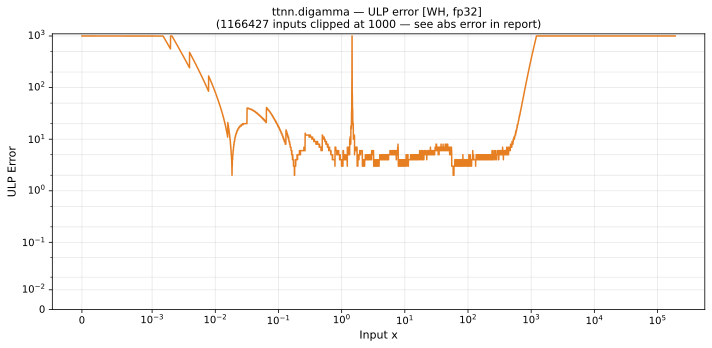

# digamma — Wormhole (WH), float32
_This page is auto-generated by `ttnn-accuracy report`. Do not edit manually._

**Architecture:** Wormhole (WH)  
**Data type:** float32  

---

[← Wormhole (WH) float32 ops](README.md) | [All archs for digamma](../../../by_op/digamma/README.md) | [Top](../../../README.md)

**Measured input range:** x ∈ [-8.389e+06, 3.403e+38]  

|  | `default` |
|---|---|
| Max ULP | 3.66e+17 ⚠ |
| Min ULP | 2.66 |
| Mean ULP | 7.77e+12 |
| Signed bias (ULP) | 7.08e+12 |
| p50 ULP | 8.91e+06 |
| p95 ULP | 1.66e+07 |
| p99 ULP | 2.86e+11 |
| Exact fraction | 0 |
| Correctly rounded | 0.00566 |
| Accurate to \|x\| | nowhere |
| Max abs error | 8.51e+37 |
| Max rel error | 2.44e+10 |
| Median rel error | 1 |
| Bits of precision (worst) | -34.5 |
| Bits of precision (median) | 1.26e-07 |

**default** — never within 2 ULP; mean 7.77e+12, worst 3.66e+17  

**Outcomes**

| Parameters | inexact | undefined |
|---|---|---|
| `default` | 50,757 | 827 |

**Worst points**

| Parameters | x | golden | device | ULP |
|---|---|---|---|---|
| `default` | -66.795906 | -6.6815478e-09 | -162.74712 | 3.66e+17 |
| `default` | -5.6671624 | 3.0198473e-07 | 309.11624 | 1.09e+16 |
| `default` | -2.6107209 | -4.8111076e-08 | -12.472308 | 3.51e+15 |
| `default` | -85156.914 | -3.9696317e-07 | -78.3406 | 2.76e+15 |
| `default` | -95.80822 | 5.399199e-08 | 6.659773 | 1.87e+15 |
| `default` | -5.653795 | 0.16997601 | -25479948 | 1.71e+15 |
| `default` | -1.5734985 | -1.4226448e-07 | 16.371117 | 1.15e+15 |
| `default` | 1.4968973e-07 | -6680486 | 4.7959175e+14 | 9.59e+14 |
| `default` | -257.66348 | 3.7814548 | -136012110 | 5.7e+14 |
| `default` | -2.7483926 | -1.9279761 | 49729012 | 4.17e+14 |

**Monotonicity**

_Checked only where the reference is itself ordered, and never across a discontinuity._

| Parameters | Pairs | Violations | Rate | Worst \|Δy\| |
|---|---|---|---|---|
| `default` | 32,511 | 1 | 3.08e-05 | 4.8e+14 |

_Worst violations — the device output moved against the reference's own direction between these neighbouring inputs._

| Parameters | x | device | \|Δy\| |
|---|---|---|---|
| `default` | 1.4968973e-07 → 1.4994293e-07 | 4.7959175e+14 → -3.9493048e+09 | 4.8e+14 |

**Non-finite outputs**

| Parameters | Points | Both | Device only | Golden only | Device inf | Device nan | Golden inf | Golden nan |
|---|---|---|---|---|---|---|---|---|
| `default` | 827 | 827 | 0 | 0 | 71 | 756 | 0 | 827 |

| Parameters | x | golden | device |
|---|---|---|---|
| `default` | -100864 | nan | -inf |
| `default` | -101376 | nan | -inf |
| `default` | -101888 | nan | -inf |
| `default` | -102400 | nan | -inf |
| `default` | -102912 | nan | -inf |
| `default` | -103424 | nan | -inf |
| `default` | -103936 | nan | -inf |
| `default` | -104448 | nan | -inf |
| `default` | -104960 | nan | -inf |
| `default` | -105472 | nan | -inf |

### Special values

| Variant | x | device | golden |  |
|---|---|---|---|---|
| `default` | 0 | 6680417.5 | -inf | **differ** |
| `default` | -0 | 6680417.5 | inf | **differ** |
| `default` | inf | inf | inf | agree |
| `default` | -inf | nan | nan | agree |
| `default` | nan | 89.09284 | nan | **differ** |
| `default` | 1.1754944e-38 | 6680417.5 | -8.507059e+37 | **differ** |
| `default` | -1.1754944e-38 | 6680417.5 | 8.507059e+37 | **differ** |

_Measured on WORMHOLE_B0 · tt-metal `a3a9fb4229a` · ttnn `0.78.0` · run `20260917T224646`_

