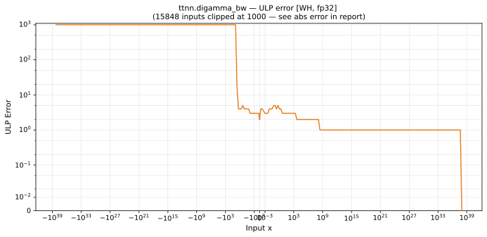

# digamma_bw — Wormhole (WH), float32
_This page is auto-generated by `ttnn-accuracy report`. Do not edit manually._

**Architecture:** Wormhole (WH)  
**Data type:** float32  

---

[← Wormhole (WH) float32 ops](README.md) | [All archs for digamma_bw](../../../by_op/digamma_bw/README.md) | [Top](../../../README.md)

**Measured input range:** x ∈ [-3.403e+38, 8.507e+37]  

| Parameters | Max ULP | Mean ULP | Accurate to \|x\| | Max abs error |
|---|---|---|---|---------------|
| `default` | 7.91e+33 ⚠ | 3.25e+29 | 8.58e-05 | 2.59e+38 |

**default** — 255 of 64769 points returned inf or zero where a value exists  

**Outcomes**

| Parameters | exact | inexact | overflow | zeroed |
|------------|------|------|------|------|
| `default` | 1 | 48,641 | 15,872 | 255 |

### Special values

| Variant | x | device | golden | |
|---|---|---|---|---|
| `default` | 0 | inf | inf | agree |
| `default` | -0 | inf | inf | agree |
| `default` | inf | 0 | 0 | agree |
| `default` | -inf | 0 | nan | **differ** |
| `default` | nan | 0 | nan | **differ** |
| `default` | 1.175e-38 | inf | inf | agree |
| `default` | -1.175e-38 | inf | inf | agree |

_Measured on WORMHOLE_B0 · tt-metal `f6deef232f7` · ttnn `0.1.dev30578+g5b8d933` · run `20260904T120341`_

