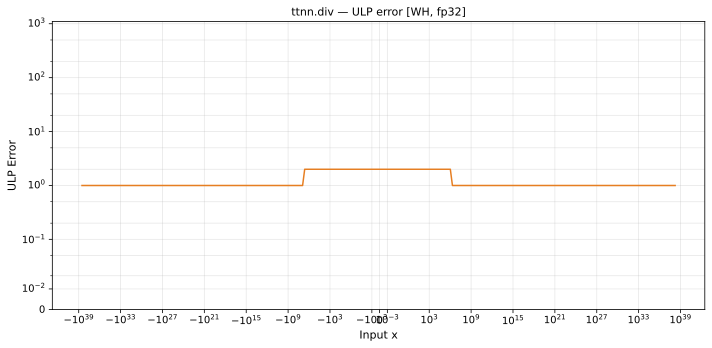

# div — Wormhole (WH), float32
_This page is auto-generated by `ttnn-accuracy report`. Do not edit manually._

**Architecture:** Wormhole (WH)  
**Data type:** float32  

---

[← Wormhole (WH) float32 ops](README.md) | [All archs for div](../../../by_op/div/README.md) | [Top](../../../README.md)

**Measured input range:** all normal values  

|  | `default` |
|---|---|
| Max ULP | 1.78 |
| Min ULP | 0.66 |
| Mean ULP | 1.22 |
| Signed bias (ULP) | -0.00476 |
| p50 ULP | 1.29 |
| p95 ULP | 1.62 |
| p99 ULP | 1.69 |
| Exact fraction | 0 |
| Correctly rounded | 0.862 |
| Max abs error | 2.53e+31 |
| Max rel error | 1.26e-07 |
| Median rel error | 8.83e-08 |
| Bits of precision (worst) | 22.9 |
| Bits of precision (median) | 23.4 |

**default** — within 2 ULP everywhere  

**Outcomes**

| Parameters | faithful | inexact |
|---|---|---|
| `default` | 18,087 | 46,937 |

**Worst points**

| Parameters | x | x2 | golden | device | ULP |
|---|---|---|---|---|---|
| `default` | 5.9831285e-36 | -5.403516e-20 | -1.1072658e-16 | -1.1072657e-16 | 1.78 |
| `default` | 7.9895644e-13 | 5.3154185e+23 | 1.5030923e-36 | 1.5030921e-36 | 1.78 |
| `default` | 2.380044e-35 | -5.403516e-20 | -4.404621e-16 | -4.4046206e-16 | 1.78 |
| `default` | -7.489902e-37 | -2.0177562e-28 | 3.7119956e-09 | 3.7119952e-09 | 1.78 |
| `default` | -5.094876e-26 | -1.36997945e+11 | 3.7189434e-37 | 3.718943e-37 | 1.78 |
| `default` | -1.1949354e-35 | -8.428444e-22 | 1.4177415e-14 | 1.4177413e-14 | 1.78 |
| `default` | -1.2813052e-26 | -1.36997945e+11 | 9.352733e-38 | 9.352732e-38 | 1.77 |
| `default` | 1.0200538e-10 | 5.3154185e+23 | 1.9190471e-34 | 1.9190469e-34 | 1.77 |
| `default` | -8.1940733e-25 | -1.36997945e+11 | 5.981165e-36 | 5.9811644e-36 | 1.77 |
| `default` | -1.48531135e-36 | -5.403516e-20 | 2.7487869e-17 | 2.7487865e-17 | 1.77 |

### Special values

| Variant | x | device | golden |  |
|---|---|---|---|---|
| `default` | 0 | 0 | 0 | agree |
| `default` | -0 | 0 | -0 | **differ** |
| `default` | inf | inf | inf | agree |
| `default` | -inf | -inf | -inf | agree |
| `default` | nan | nan | nan | agree |
| `default` | 1.1754944e-38 | 1.1754944e-38 | 1.1754944e-38 | agree |
| `default` | -1.1754944e-38 | -1.1754944e-38 | -1.1754944e-38 | agree |

> **Sampled, not exhaustive.** For this op both operands take 65,536 of the 2³² fp32 values, drawn once from a fixed seed. The figures above are a lower bound on the error, and comparable between releases, but they are not a bound over the dtype.

_Measured on WORMHOLE_B0 · tt-metal `a3a9fb4229a` · ttnn `0.78.0` · run `20260917T224646`_

