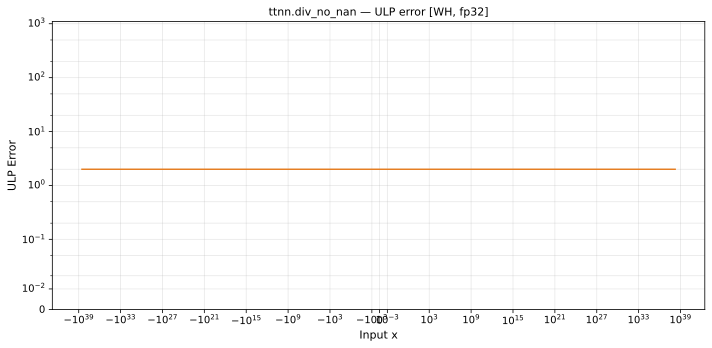

# div_no_nan — Wormhole (WH), float32
_This page is auto-generated by `ttnn-accuracy report`. Do not edit manually._

**Architecture:** Wormhole (WH)  
**Data type:** float32  

---

[← Wormhole (WH) float32 ops](README.md) | [All archs for div_no_nan](../../../by_op/div_no_nan/README.md) | [Top](../../../README.md)

**Measured input range:** all normal values  

|  | `default` |
|---|---|
| Max ULP | 1.79 |
| Min ULP | 1.2 |
| Mean ULP | 1.52 |
| Signed bias (ULP) | -0.00544 |
| p50 ULP | 1.52 |
| p95 ULP | 1.7 |
| p99 ULP | 1.74 |
| Exact fraction | 0 |
| Correctly rounded | 0.714 |
| Max abs error | 3.59e+31 |
| Max rel error | 1.28e-07 |
| Median rel error | 1.01e-07 |
| Bits of precision (worst) | 22.9 |
| Bits of precision (median) | 23.2 |

**default** — within 2 ULP everywhere  

**Outcomes**

| Parameters | inexact |
|---|---|
| `default` | 65,024 |

**Worst points**

| Parameters | x | x2 | golden | device | ULP |
|---|---|---|---|---|---|
| `default` | -8.2316787e-25 | -5.403516e-20 | 1.5233931e-05 | 1.5233929e-05 | 1.79 |
| `default` | 2085279.8 | -5.403516e-20 | -3.8591165e+25 | -3.859116e+25 | 1.79 |
| `default` | 5.4711924e+11 | -5.403516e-20 | -1.0125245e+31 | -1.0125244e+31 | 1.79 |
| `default` | -1.13360066e-13 | 1.5017831e-36 | -7.548365e+22 | -7.548364e+22 | 1.79 |
| `default` | 1.1066153e-16 | -5.403516e-20 | -2047.9542 | -2047.954 | 1.79 |
| `default` | 1.5743674e+29 | -1.36997945e+11 | -1.1491905e+18 | -1.1491904e+18 | 1.79 |
| `default` | -1.5133359e-05 | -5.403516e-20 | 2.8006504e+14 | 2.80065e+14 | 1.79 |
| `default` | 260068.92 | -1.36997945e+11 | -1.8983418e-06 | -1.8983416e-06 | 1.79 |
| `default` | 8.5283374e+09 | -5.403516e-20 | -1.5782941e+29 | -1.5782939e+29 | 1.79 |
| `default` | -0.0019424993 | -5.403516e-20 | 3.5948803e+16 | 3.59488e+16 | 1.78 |

### Special values

| Variant | x | device | golden |  |
|---|---|---|---|---|
| `default` | 0 | 0 | 0 | agree |
| `default` | -0 | 0 | -0 | **differ** |
| `default` | inf | inf | inf | agree |
| `default` | -inf | -inf | -inf | agree |
| `default` | nan | nan | nan | agree |
| `default` | 1.1754944e-38 | 1.1754944e-38 | 1.1754944e-38 | agree |
| `default` | -1.1754944e-38 | -1.1754944e-38 | -1.1754944e-38 | agree |

> **Sampled, not exhaustive.** For this op both operands take 65,536 of the 2³² fp32 values, drawn once from a fixed seed. The figures above are a lower bound on the error, and comparable between releases, but they are not a bound over the dtype.

_Measured on WORMHOLE_B0 · tt-metal `a3a9fb4229a` · ttnn `0.78.0` · run `20260929T112604`_

