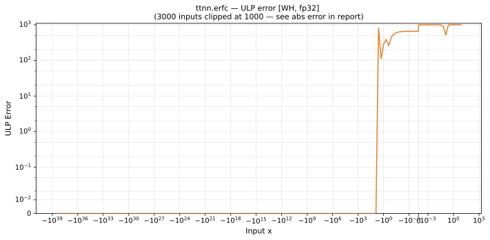

# erfc — Wormhole (WH), float32
_This page is auto-generated by `ttnn-accuracy report`. Do not edit manually._

**Architecture:** Wormhole (WH)  
**Data type:** float32  

---

[← Wormhole (WH) float32 ops](README.md) | [All archs for erfc](../../../by_op/erfc/README.md) | [Top](../../../README.md)

**Measured input range:** x ∈ [-3.403e+38, 3.403e+38]  

| Parameters | Max ULP | Mean ULP | Accurate to \|x\| | Max abs error |
|---|---|---|---|---------------|
| `default` | 2.1e+33 ⚠ | 1.71e+29 | nowhere | 9.7e-05 |

**default** — never within 2 ULP; mean 1.71e+29, worst 2.1e+33  

**Outcomes**

| Parameters | exact | flushed | inexact |
|------------|------|------|------|
| `default` | 16,148 | 198 | 48,678 |

### Special values

| Variant | x | device | golden | |
|---|---|---|---|---|
| `default` | 0 | 0.9999 | 1 | **differ** |
| `default` | -0 | 1 | 1 | agree |
| `default` | inf | 2.942e-12 | 0 | **differ** |
| `default` | -inf | 2 | 2 | agree |
| `default` | nan | 2.942e-12 | nan | **differ** |
| `default` | 1.175e-38 | 0.9999 | 1 | **differ** |
| `default` | -1.175e-38 | 1 | 1 | agree |

_Measured on WORMHOLE_B0 · tt-metal `812427269cb` · ttnn `0.1.dev30578+g5b8d933` · run `20260902T135808`_

