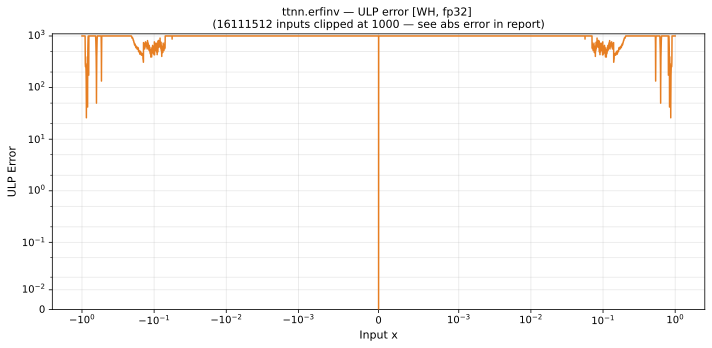

# erfinv — Wormhole (WH), float32
_This page is auto-generated by `ttnn-accuracy report`. Do not edit manually._

_Generated: 2026-08-31 09:14_

**Architecture:** Wormhole (WH)  
**Data type:** float32  

---

[← Wormhole (WH) float32 ops](README.md) | [All archs for erfinv](../../../by_op/erfinv/README.md) | [Top](../../../README.md)

**Measured input range:** x ∈ [-1, 1]  

| Parameters | Max ULP | Mean ULP | Accurate to \|x\| | Max abs error |
|---|---|---|---|---------------|
| `default` | 7.96e+06 ⚠ | 2.62e+05 | 0.000511 | 0.00522 |

**default** — accurate to |x| <= 0.000511; up to 7.96e+06 ULP beyond  

**Outcomes**

| Parameters | flushed | inexact | zeroed |
|------------|------|------|------|
| `default` | 32 | 2,800 | 29,424 |

_Measured on WORMHOLE_B0 · tt-metal `2adf8c65887` · ttnn `0.75.0rc10.dev817+g2adf8c65887` · run `20260831T073009`_

