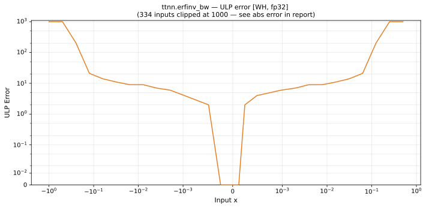

# erfinv_bw — Wormhole (WH), float32
_This page is auto-generated by `ttnn-accuracy report`. Do not edit manually._

**Architecture:** Wormhole (WH)  
**Data type:** float32  

---

[← Wormhole (WH) float32 ops](README.md) | [All archs for erfinv_bw](../../../by_op/erfinv_bw/README.md) | [Top](../../../README.md)

**Measured input range:** x ∈ [-1, 1]  

|  | `default` |
|---|---|
| Max ULP | 4.98e+05 ⚠ |
| Min ULP | 0.00404 |
| Mean ULP | 1.32e+03 |
| Signed bias (ULP) | 829 |
| p50 ULP | 0.447 |
| p95 ULP | 6.56 |
| p99 ULP | 1.03e+03 |
| Exact fraction | 0.908 |
| Correctly rounded | 0.913 |
| Accurate to \|x\| | 0.000456 |
| Max abs error | 243 |
| Max rel error | 0.0297 |
| Median rel error | 5.14e-07 |
| Bits of precision (worst) | 5.07 |
| Bits of precision (median) | 20.9 |

**default** — accurate to |x| <= 0.000456; up to 4.98e+05 ULP beyond  

**Outcomes**

| Parameters | exact | faithful | inexact |
|---|---|---|---|
| `default` | 29,280 | 170 | 2,806 |

**Worst points**

| Parameters | x | golden | device | ULP |
|---|---|---|---|---|
| `default` | 0.99998075 | 8185.7505 | 7942.346 | 4.98e+05 |
| `default` | -0.99998075 | 8185.7505 | 7942.346 | 4.98e+05 |
| `default` | 0.9960937 | 56.977036 | 56.19913 | 2.04e+05 |
| `default` | -0.9960937 | 56.977036 | 56.19913 | 2.04e+05 |
| `default` | 0.99218744 | 30.483648 | 30.181248 | 1.59e+05 |
| `default` | -0.99218744 | 30.483648 | 30.181248 | 1.59e+05 |
| `default` | 0.9838512 | 15.998854 | 15.898981 | 1.05e+05 |
| `default` | -0.9838512 | 15.998854 | 15.898981 | 1.05e+05 |
| `default` | 0.9882117 | 21.124516 | 20.965471 | 8.34e+04 |
| `default` | -0.9882117 | 21.124516 | 20.965471 | 8.34e+04 |

**Monotonicity**

_Checked only where the reference is itself ordered, and never across a discontinuity._

| Parameters | Pairs | Violations | Rate | Worst \|Δy\| |
|---|---|---|---|---|
| `default` | 32,254 | 6 | 0.000186 | 5e-07 |

_Worst violations — the device output moved against the reference's own direction between these neighbouring inputs._

| Parameters | x | device | \|Δy\| |
|---|---|---|---|
| `default` | -0.0061340327 → -0.0060912967 | 0.8862527 → 0.8862532 | 5e-07 |
| `default` | 0.0060912967 → 0.0061340327 | 0.8862532 → 0.8862527 | 5e-07 |
| `default` | -0.0018310546 → -0.0018157959 | 0.88622904 → 0.8862295 | 4.6e-07 |
| `default` | 0.0018157959 → 0.0018310546 | 0.8862295 → 0.88622904 | 4.6e-07 |
| `default` | -0.003463745 → -0.0034332275 | 0.886235 → 0.8862354 | 4e-07 |

### Special values

| Variant | x | device | golden |  |
|---|---|---|---|---|
| `default` | 0 | 0.88622695 | 0.88622695 | agree |
| `default` | -0 | 0.88622695 | 0.88622695 | agree |
| `default` | inf | nan | nan | agree |
| `default` | -inf | nan | nan | agree |
| `default` | nan | nan | nan | agree |
| `default` | 1.1754944e-38 | 0.88622695 | 0.88622695 | agree |
| `default` | -1.1754944e-38 | 0.88622695 | 0.88622695 | agree |

> **Provenance unknown.** These figures predate run tracking. Re-measure to attribute them.

