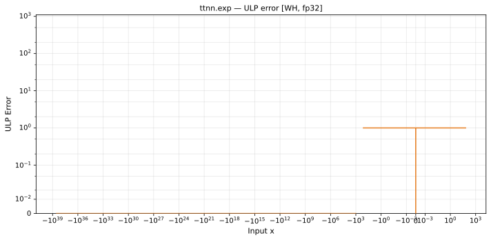
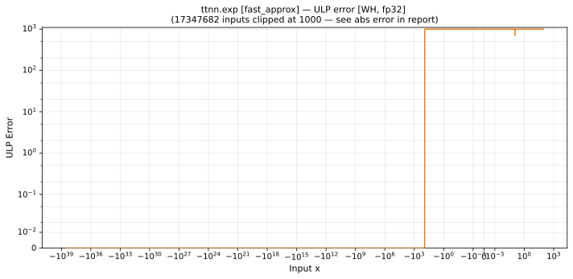

# exp — Wormhole (WH), float32
_This page is auto-generated by `ttnn-accuracy report`. Do not edit manually._

**Architecture:** Wormhole (WH)  
**Data type:** float32  

---

[← Wormhole (WH) float32 ops](README.md) | [All archs for exp](../../../by_op/exp/README.md) | [Top](../../../README.md)

**Measured input range:** x ∈ [-3.403e+38, 88.67]  

|  | `default` | `fast_approx` |
|---|---|---|
| Max ULP | 0.866 | 3.79e+05 ⚠ |
| Min ULP | 0 | 0 |
| Mean ULP | 0.578 | 2e+05 |
| Signed bias (ULP) | 0.106 | 1.7e+05 |
| p50 ULP | 0 | 1.8e+05 |
| p95 ULP | 0.54 | 3.59e+05 |
| p99 ULP | 0.735 | 3.72e+05 |
| Exact fraction | 0.889 | 0.309 |
| Correctly rounded | 0.997 | 0.309 |
| Accurate to \|x\| | 3.39e+38 | nowhere |
| Max abs error | 1.5e+31 | 6.16e+36 |
| Max rel error | 7.6e-08 | 0.0312 |
| Median rel error | 5.95e-08 | 0.0215 |
| Bits of precision (worst) | 23.6 | 5 |
| Bits of precision (median) | 24 | 5.54 |

**default** — faithful; 5447/49458 tie-breaks  
**fast_approx** — never within 2 ULP · _the approximation mode models opt into for speed_  

**Outcomes**

| Parameters | exact | faithful | flushed | inexact |
|---|---|---|---|---|
| `default` | 43,616 | 5,447 | 395 | 0 |
| `fast_approx` | 15,174 | 0 | 395 | 33,889 |

**Worst points**

| Parameters | x | golden | device | ULP |
|---|---|---|---|---|
| `default` | -5.878474 | 0.0027990527 | 0.0027990525 | 0.866 |
| `default` | 59.948647 | 1.0848418e+26 | 1.0848417e+26 | 0.866 |
| `default` | -5.871701 | 0.0028180764 | 0.0028180762 | 0.864 |
| `default` | -16.959711 | 4.310137e-08 | 4.3101366e-08 | 0.862 |
| `default` | 5.293156 | 198.97041 | 198.97043 | 0.861 |
| `default` | -71.03538 | 1.4116516e-31 | 1.4116515e-31 | 0.861 |
| `default` | 16.284622 | 11811949 | 11811948 | 0.86 |
| `default` | 5.2022505 | 181.68065 | 181.68066 | 0.86 |
| `default` | -5.1991982 | 0.005520989 | 0.0055209887 | 0.86 |
| `default` | 37.870823 | 2.7995576e+16 | 2.7995578e+16 | 0.86 |
| `fast_approx` | -84.56482 | 1.8791679e-37 | 1.8367099e-37 | 3.79e+05 |
| `fast_approx` | -76.9402 | 3.8485343e-34 | 3.761582e-34 | 3.79e+05 |
| `fast_approx` | -47.134872 | 3.3852052e-21 | 3.3087225e-21 | 3.79e+05 |
| `fast_approx` | -52.68005 | 1.3223458e-23 | 1.2924697e-23 | 3.79e+05 |
| `fast_approx` | -58.225227 | 5.165413e-26 | 5.0487098e-26 | 3.79e+05 |
| `fast_approx` | -63.770405 | 2.0177394e-28 | 1.9721523e-28 | 3.79e+05 |
| `fast_approx` | -80.40594 | 1.2026664e-35 | 1.17549435e-35 | 3.79e+05 |
| `fast_approx` | -45.05543 | 2.7081628e-20 | 2.646978e-20 | 3.79e+05 |
| `fast_approx` | -0.000864636 | 0.99913573 | 0.9765625 | 3.79e+05 |
| `fast_approx` | -50.60061 | 1.0578761e-22 | 1.03397577e-22 | 3.79e+05 |

**Monotonicity**

_Checked only where the reference is itself ordered, and never across a discontinuity._

| Parameters | Pairs | Violations | Rate | Worst \|Δy\| |
|---|---|---|---|---|
| `default` | 49,060 | 0 | 0 | 0 |
| `fast_approx` | 49,060 | 0 | 0 | 0 |

### Special values

| Variant | x | device | golden |  |
|---|---|---|---|---|
| `default` | 0 | 1 | 1 | agree |
| `default` | -0 | 1 | 1 | agree |
| `default` | inf | inf | inf | agree |
| `default` | -inf | 0 | 0 | agree |
| `default` | nan | nan | nan | agree |
| `default` | 1.1754944e-38 | 1 | 1 | agree |
| `default` | -1.1754944e-38 | 1 | 1 | agree |
| `fast_approx` | 0 | 0.9785156 | 1 | **differ** |
| `fast_approx` | -0 | 0.9785156 | 1 | **differ** |
| `fast_approx` | inf | nan | inf | **differ** |
| `fast_approx` | -inf | 0 | 0 | agree |
| `fast_approx` | nan | nan | nan | agree |
| `fast_approx` | 1.1754944e-38 | 0.9785156 | 1 | **differ** |
| `fast_approx` | -1.1754944e-38 | 0.9785156 | 1 | **differ** |

_Measured on WORMHOLE_B0 · tt-metal `de546d3b146` · ttnn `0.79.0` · run `20261003T030251`_

### `default`

### `fast_approx`

