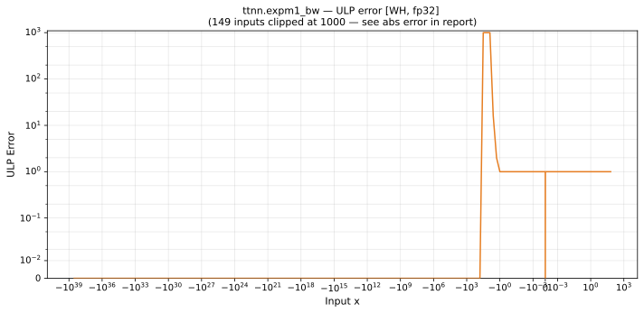

# expm1_bw — Wormhole (WH), float32
_This page is auto-generated by `ttnn-accuracy report`. Do not edit manually._

**Architecture:** Wormhole (WH)  
**Data type:** float32  

---

[← Wormhole (WH) float32 ops](README.md) | [All archs for expm1_bw](../../../by_op/expm1_bw/README.md) | [Top](../../../README.md)

**Measured input range:** x ∈ [-3.403e+38, 88.67]  

|  | `default` |
|---|---|
| Max ULP | 4.91e+06 ⚠ |
| Min ULP | 0 |
| Mean ULP | 1.14e+04 |
| Signed bias (ULP) | -2.57e+03 |
| p50 ULP | 0 |
| p95 ULP | 0.532 |
| p99 ULP | 1.2 |
| Exact fraction | 0.89 |
| Correctly rounded | 0.985 |
| Accurate to \|x\| | 1.39 |
| Max abs error | 1.76e+31 |
| Max rel error | 0.414 |
| Median rel error | 5.94e-08 |
| Bits of precision (worst) | 1.27 |
| Bits of precision (median) | 24 |

**default** — 138 of 49458 points returned inf or zero where a value exists  

**Outcomes**

| Parameters | exact | faithful | inexact | zeroed |
|---|---|---|---|---|
| `default` | 43,889 | 4,824 | 607 | 138 |

**Worst points**

| Parameters | x | golden | device | ULP |
|---|---|---|---|---|
| `default` | -16.982105 | 4.2146876e-08 | 5.9604645e-08 | 4.91e+06 |
| `default` | -16.230066 | 8.940705e-08 | 1.1920929e-07 | 4.19e+06 |
| `default` | -16.25 | 8.764248e-08 | 5.9604645e-08 | 3.95e+06 |
| `default` | -16.874998 | 4.691173e-08 | 5.9604645e-08 | 3.57e+06 |
| `default` | -16.124998 | 9.931213e-08 | 1.1920929e-07 | 2.8e+06 |
| `default` | -16.375 | 7.734422e-08 | 5.9604645e-08 | 2.5e+06 |
| `default` | -15.38277 | 2.0861621e-07 | 1.7881393e-07 | 2.1e+06 |
| `default` | -15.719241 | 1.4901168e-07 | 1.7881393e-07 | 2.1e+06 |
| `default` | -15.374999 | 2.1024358e-07 | 2.3841858e-07 | 1.98e+06 |
| `default` | -16.749998 | 5.3157954e-08 | 5.9604645e-08 | 1.81e+06 |

**Monotonicity**

_Checked only where the reference is itself ordered, and never across a discontinuity._

| Parameters | Pairs | Violations | Rate | Worst \|Δy\| |
|---|---|---|---|---|
| `default` | 49,317 | 0 | 0 | 0 |

### Special values

| Variant | x | device | golden |  |
|---|---|---|---|---|
| `default` | 0 | 1 | 1 | agree |
| `default` | -0 | 1 | 1 | agree |
| `default` | inf | inf | inf | agree |
| `default` | -inf | 0 | 0 | agree |
| `default` | nan | nan | nan | agree |
| `default` | 1.1754944e-38 | 1 | 1 | agree |
| `default` | -1.1754944e-38 | 1 | 1 | agree |

> **Provenance unknown.** These figures predate run tracking. Re-measure to attribute them.

