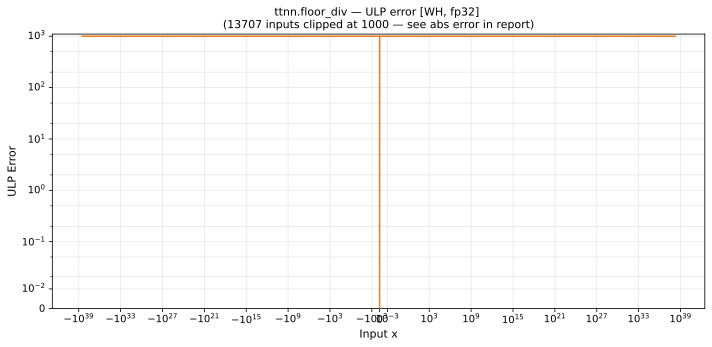

# floor_div — Wormhole (WH), float32
_This page is auto-generated by `ttnn-accuracy report`. Do not edit manually._

_Generated: 2026-08-31 08:14_

**Architecture:** Wormhole (WH)  
**Data type:** float32  

---

[← Wormhole (WH) float32 ops](README.md) | [All archs for floor_div](../../../by_op/floor_div/README.md) | [Top](../../../README.md)

**Measured input range:** all normal values  

| Parameters | Max ULP | Mean ULP | Accurate to \|x\| | Max abs error |
|------------|---------|----------|-----------------|---------------|
| `default` | 4.19e+06 ⚠ | 1.77e+03 | — | 1 |

**default** — worst pairing 4.19e+06 ULP; mean 1.77e+03  

**Outcomes**

| Parameters | exact | inexact |
|------------|------|------|
| `default` | 3,865 | 61,159 |

### Special values

| Variant | x | device | golden | |
|---|---|---|---|---|
| `default` | 0 | 0 | 0 | agree |
| `default` | -0 | 0 | -0 | **differ** |
| `default` | inf | inf | nan | **differ** |
| `default` | -inf | -inf | nan | **differ** |
| `default` | nan | nan | nan | agree |
| `default` | 1.175e-38 | 0 | 0 | agree |
| `default` | -1.175e-38 | -1 | -1 | agree |

> **Sampled, not exhaustive.** For this op both operands take 65,536 of the 2³² fp32 values, drawn once from a fixed seed. The figures above are a lower bound on the error, and comparable between releases, but they are not a bound over the dtype.

_Measured on WORMHOLE_B0 · tt-metal `2adf8c65887` · ttnn `0.75.0rc10.dev817+g2adf8c65887` · run `20260831T073009`_

