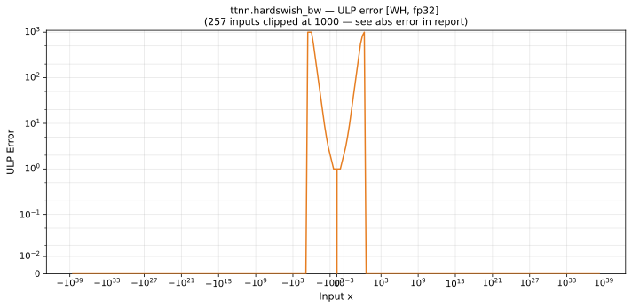

# hardswish_bw — Wormhole (WH), float32
_This page is auto-generated by `ttnn-accuracy report`. Do not edit manually._

**Architecture:** Wormhole (WH)  
**Data type:** float32  

---

[← Wormhole (WH) float32 ops](README.md) | [All archs for hardswish_bw](../../../by_op/hardswish_bw/README.md) | [Top](../../../README.md)

**Measured input range:** x ∈ [-3.403e+38, 3.403e+38]  

|  | `default` |
|---|---|
| Max ULP | 1.41e+10 ⚠ |
| Min ULP | 0 |
| Mean ULP | 6e+06 |
| Signed bias (ULP) | -6e+06 |
| p50 ULP | 0 |
| p95 ULP | 0.856 |
| p99 ULP | 411 |
| Exact fraction | 0.928 |
| Correctly rounded | 0.95 |
| Accurate to \|x\| | 0.00133 |
| Max abs error | 0.5 |
| Max rel error | 1.26e+03 |
| Median rel error | 3.94e-07 |
| Bits of precision (worst) | -10.3 |
| Bits of precision (median) | 21.3 |

**default** — accurate to |x| <= 0.00133; up to 1.41e+10 ULP beyond  

**Outcomes**

| Parameters | exact | faithful | inexact |
|---|---|---|---|
| `default` | 60,329 | 1,578 | 3,117 |

**Worst points**

| Parameters | x | golden | device | ULP |
|---|---|---|---|---|
| `default` | -1.5000001 | -3.973643e-08 | 4.9978495e-05 | 1.41e+10 |
| `default` | -1.4999999 | 3.973643e-08 | 5.00381e-05 | 1.41e+10 |
| `default` | 3 | 1 | 1.4999 | 4.19e+06 |
| `default` | -1.5116211 | -0.0038737059 | -0.0038232803 | 2.17e+05 |
| `default` | -1.4921038 | 0.0026320617 | 0.0026818216 | 2.14e+05 |
| `default` | -1.5229442 | -0.007648071 | -0.0075972676 | 1.09e+05 |
| `default` | -1.4843566 | 0.0052144527 | 0.0052639544 | 1.06e+05 |
| `default` | -1.5467821 | -0.015594046 | -0.015542448 | 5.54e+04 |
| `default` | -1.5390346 | -0.013011535 | -0.012960196 | 5.51e+04 |
| `default` | -1.5306914 | -0.010230462 | -0.0101794 | 5.48e+04 |

### Special values

| Variant | x | device | golden |  |
|---|---|---|---|---|
| `default` | 0 | 0.5 | 0.5 | agree |
| `default` | -0 | 0.5 | 0.5 | agree |
| `default` | inf | 1 | 1 | agree |
| `default` | -inf | 0 | 0 | agree |
| `default` | nan | 1 | nan | **differ** |
| `default` | 1.1754944e-38 | 0.5 | 0.5 | agree |
| `default` | -1.1754944e-38 | 0.5 | 0.5 | agree |

_Measured on WORMHOLE_B0 · tt-metal `a3a9fb4229a` · ttnn `0.78.0` · run `20260929T111615`_

