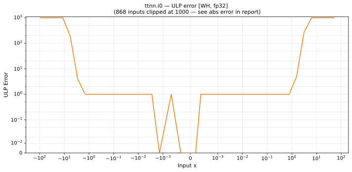

# i0 — Wormhole (WH), float32
_This page is auto-generated by `ttnn-accuracy report`. Do not edit manually._

**Architecture:** Wormhole (WH)  
**Data type:** float32  

---

[← Wormhole (WH) float32 ops](README.md) | [All archs for i0](../../../by_op/i0/README.md) | [Top](../../../README.md)

**Measured input range:** x ∈ [-91.8, 91.8]  

|  | `default` |
|---|---|
| Max ULP | 1.68e+07 ⚠ |
| Min ULP | 0 |
| Mean ULP | 2.19e+06 |
| Signed bias (ULP) | 2.19e+06 |
| p50 ULP | 0 |
| p95 ULP | 0.663 |
| p99 ULP | 1.25e+07 |
| Exact fraction | 0.901 |
| Correctly rounded | 0.959 |
| Accurate to \|x\| | 2.45 |
| Max abs error | 3.09e+38 |
| Max rel error | 1 |
| Median rel error | 6.56e-08 |
| Bits of precision (worst) | -0 |
| Bits of precision (median) | 23.9 |

**default** — accurate to |x| <= 2.45  

**Outcomes**

| Parameters | exact | faithful | inexact |
|---|---|---|---|
| `default` | 30,548 | 1,848 | 1,508 |

**Worst points**

| Parameters | x | golden | device | ULP |
|---|---|---|---|---|
| `default` | 74.46658 | 1.0141204e+31 | 2.501186e+19 | 1.68e+07 |
| `default` | -74.46658 | 1.0141204e+31 | 2.501186e+19 | 1.68e+07 |
| `default` | 67.48572 | 9.903517e+27 | 2.9269662e+18 | 1.68e+07 |
| `default` | -67.48572 | 9.903517e+27 | 2.9269662e+18 | 1.68e+07 |
| `default` | 55.604992 | 7.5557846e+22 | 4.3648894e+16 | 1.68e+07 |
| `default` | -55.604992 | 7.5557846e+22 | 4.3648894e+16 | 1.68e+07 |
| `default` | 62.595932 | 7.7371174e+25 | 5.69933e+17 | 1.68e+07 |
| `default` | -62.595932 | 7.7371174e+25 | 5.69933e+17 | 1.68e+07 |
| `default` | 85.62698 | 6.6461325e+35 | 5.2813305e+20 | 1.68e+07 |
| `default` | -85.62698 | 6.6461325e+35 | 5.2813305e+20 | 1.68e+07 |

**Monotonicity**

_Checked only where the reference is itself ordered, and never across a discontinuity._

| Parameters | Pairs | Violations | Rate | Worst \|Δy\| |
|---|---|---|---|---|
| `default` | 33,902 | 0 | 0 | 0 |

### Special values

| Variant | x | device | golden |  |
|---|---|---|---|---|
| `default` | 0 | 1 | 1 | agree |
| `default` | -0 | 1 | 1 | agree |
| `default` | inf | inf | nan | **differ** |
| `default` | -inf | inf | nan | **differ** |
| `default` | nan | nan | nan | agree |
| `default` | 1.1754944e-38 | 1 | 1 | agree |
| `default` | -1.1754944e-38 | 1 | 1 | agree |

_Measured on WORMHOLE_B0 · tt-metal `de546d3b146` · ttnn `0.79.0` · run `20261010T030007`_

