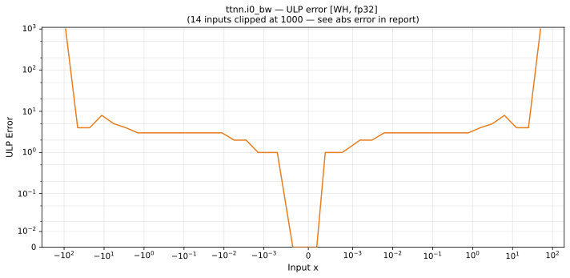

# i0_bw — Wormhole (WH), float32
_This page is auto-generated by `ttnn-accuracy report`. Do not edit manually._

**Architecture:** Wormhole (WH)  
**Data type:** float32  

---

[← Wormhole (WH) float32 ops](README.md) | [All archs for i0_bw](../../../by_op/i0_bw/README.md) | [Top](../../../README.md)

**Measured input range:** x ∈ [-91.8, 91.8]  

|  | `default` |
|---|---|
| Max ULP | 1.56e+07 ⚠ |
| Min ULP | 0 |
| Mean ULP | 4.11e+04 |
| Signed bias (ULP) | 0 |
| p50 ULP | 3.73e-09 |
| p95 ULP | 2.56 |
| p99 ULP | 3.42 |
| Exact fraction | 0.877 |
| Correctly rounded | 0.929 |
| Accurate to \|x\| | 0.00626 |
| Max abs error | 2.96e+38 |
| Max rel error | 0.963 |
| Median rel error | 1.99e-07 |
| Bits of precision (worst) | 0.055 |
| Bits of precision (median) | 22.3 |

**default** — accurate to |x| <= 0.00626  

**Outcomes**

| Parameters | exact | faithful | flushed | inexact |
|---|---|---|---|---|
| `default` | 29,518 | 404 | 256 | 3,726 |

**Worst points**

| Parameters | x | golden | device | ULP |
|---|---|---|---|---|
| `default` | 91.20934 | 1.7014112e+38 | 1.1498717e+37 | 1.56e+07 |
| `default` | -91.20934 | -1.7014112e+38 | -1.1498717e+37 | 1.56e+07 |
| `default` | 91.8043 | 3.0746454e+38 | 1.1498717e+37 | 1.46e+07 |
| `default` | -91.8043 | -3.0746454e+38 | -1.1498717e+37 | 1.46e+07 |
| `default` | 90.51239 | 8.5070364e+37 | 1.1498717e+37 | 1.45e+07 |
| `default` | -90.51239 | -8.5070364e+37 | -1.1498717e+37 | 1.45e+07 |
| `default` | 90.49999 | 8.40279e+37 | 1.1498717e+37 | 1.43e+07 |
| `default` | -90.49999 | -8.40279e+37 | -1.1498717e+37 | 1.43e+07 |
| `default` | 89.81541 | 4.253503e+37 | 1.1498717e+37 | 1.22e+07 |
| `default` | -89.81541 | -4.253503e+37 | -1.1498717e+37 | 1.22e+07 |

**Monotonicity**

_Checked only where the reference is itself ordered, and never across a discontinuity._

| Parameters | Pairs | Violations | Rate | Worst \|Δy\| |
|---|---|---|---|---|
| `default` | 33,646 | 0 | 0 | 0 |

### Special values

| Variant | x | device | golden |  |
|---|---|---|---|---|
| `default` | 0 | 0 | 0 | agree |
| `default` | -0 | 0 | 0 | agree |
| `default` | inf | 1.1498717e+37 | nan | **differ** |
| `default` | -inf | -1.1498717e+37 | nan | **differ** |
| `default` | nan | 1.1498717e+37 | nan | **differ** |
| `default` | 1.1754944e-38 | 0 | 5.877472e-39 | **differ** |
| `default` | -1.1754944e-38 | 0 | -5.877472e-39 | **differ** |

_Measured on WORMHOLE_B0 · tt-metal `de546d3b146` · ttnn `0.79.0` · run `20261010T025807`_

