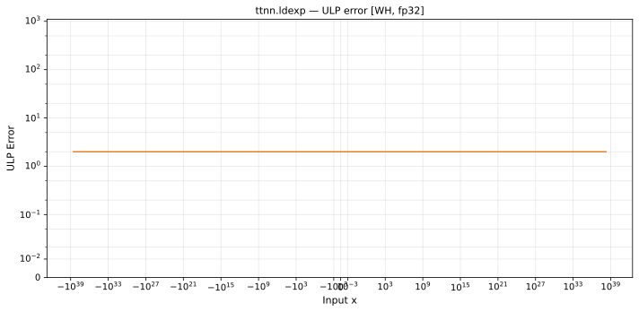

# ldexp — Wormhole (WH), float32
_This page is auto-generated by `ttnn-accuracy report`. Do not edit manually._

**Architecture:** Wormhole (WH)  
**Data type:** float32  

---

[← Wormhole (WH) float32 ops](README.md) | [All archs for ldexp](../../../by_op/ldexp/README.md) | [Top](../../../README.md)

**Measured input range:** all normal values  

|  | `default` |
|---|---|
| Max ULP | 1.92 |
| Min ULP | 1.1 |
| Mean ULP | 1.52 |
| Signed bias (ULP) | 0.000826 |
| p50 ULP | 1.5 |
| p95 ULP | 1.74 |
| p99 ULP | 1.82 |
| Exact fraction | 0 |
| Correctly rounded | 0.953 |
| Max abs error | 3.77e+31 |
| Max rel error | 1.33e-07 |
| Median rel error | 1.03e-07 |
| Bits of precision (worst) | 22.8 |
| Bits of precision (median) | 23.2 |

**default** — within 2 ULP  

**Outcomes**

| Parameters | inexact |
|---|---|
| `default` | 65,024 |

**Worst points**

| Parameters | x | x2 | golden | device | ULP |
|---|---|---|---|---|---|
| `default` | 7.556727e-10 | 35.29998 | 31.965876 | 31.965872 | 1.92 |
| `default` | -6.875833e-22 | 35.29998 | -2.908561e-11 | -2.9085607e-11 | 1.92 |
| `default` | -5.710957e+13 | 35.29998 | -2.4158045e+24 | -2.4158042e+24 | 1.92 |
| `default` | -4.8330957e-08 | 35.29998 | -2044.4584 | -2044.4581 | 1.92 |
| `default` | -2.6089847e-27 | 35.29998 | -1.1036323e-16 | -1.1036322e-16 | 1.91 |
| `default` | 1.9484964e-35 | 35.29998 | 8.242377e-25 | 8.242376e-25 | 1.91 |
| `default` | -1.4837517e+19 | 35.29998 | -6.2764504e+29 | -6.2764497e+29 | 1.91 |
| `default` | 4.278958e-23 | 35.29998 | 1.8100513e-12 | 1.8100511e-12 | 1.91 |
| `default` | 7.4279636e+18 | 35.29998 | 3.1421191e+29 | 3.1421187e+29 | 1.91 |
| `default` | -1.2211939e+23 | 35.29998 | -5.165799e+33 | -5.1657984e+33 | 1.9 |

### Special values

| Variant | x | device | golden |  |
|---|---|---|---|---|
| `default` | 0 | 0 | 0 | agree |
| `default` | -0 | 0 | -0 | **differ** |
| `default` | inf | inf | inf | agree |
| `default` | -inf | -inf | -inf | agree |
| `default` | nan | nan | nan | agree |
| `default` | 1.1754944e-38 | 2.3509887e-38 | 2.3509887e-38 | agree |
| `default` | -1.1754944e-38 | -2.3509887e-38 | -2.3509887e-38 | agree |

> **Sampled, not exhaustive.** For this op both operands take 65,536 of the 2³² fp32 values, drawn once from a fixed seed. The figures above are a lower bound on the error, and comparable between releases, but they are not a bound over the dtype.

> **Provenance unknown.** These figures predate run tracking. Re-measure to attribute them.

