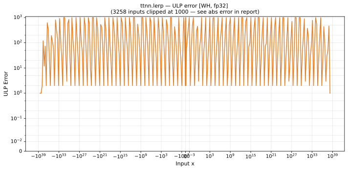

# lerp — Wormhole (WH), float32
_This page is auto-generated by `ttnn-accuracy report`. Do not edit manually._

**Architecture:** Wormhole (WH)  
**Data type:** float32  

---

[← Wormhole (WH) float32 ops](README.md) | [All archs for lerp](../../../by_op/lerp/README.md) | [Top](../../../README.md)

**Measured input range:** all normal values  

|  | `default` |
|---|---|
| Max ULP | 1.46e+08 ⚠ |
| Min ULP | 0.456 |
| Mean ULP | 9.53e+04 |
| Signed bias (ULP) | -1.68e+04 |
| p50 ULP | 1.8 |
| p95 ULP | 1.01e+03 |
| p99 ULP | 8.09e+05 |
| Exact fraction | 0.00203 |
| Correctly rounded | 0.962 |
| Max abs error | 2.44e+31 |
| Max rel error | 15.3 |
| Median rel error | 1.38e-07 |
| Bits of precision (worst) | -3.93 |
| Bits of precision (median) | 22.8 |

**default** — worst sampled pairing  

**Outcomes**

| Parameters | exact | faithful | inexact |
|---|---|---|---|
| `default` | 132 | 1,148 | 63,744 |

**Worst points**

| Parameters | x | x2 | x3 | golden | device | ULP |
|---|---|---|---|---|---|---|
| `default` | 1.914935e-37 | 1.8830837e-37 | 64.32767 | -1.3399128e-38 | 1.914935e-37 | 1.46e+08 |
| `default` | -7.639866e-37 | -7.530445e-37 | 64.32767 | -6.010965e-38 | -7.639866e-37 | 1.26e+08 |
| `default` | 1.7837277e-37 | 1.8830837e-37 | -16.068098 | 1.8726602e-38 | 1.7837277e-37 | 1.14e+08 |
| `default` | 1.788509e-37 | 1.8830837e-37 | -16.068098 | 2.6887252e-38 | 1.788509e-37 | 5.42e+07 |
| `default` | 1.7971499e-37 | 1.8830837e-37 | -16.068098 | 4.163574e-38 | 1.7971499e-37 | 4.93e+07 |
| `default` | -4.3187032e-38 | -4.7278667e-38 | -16.068098 | 2.2557754e-38 | -4.3187032e-38 | 4.69e+07 |
| `default` | -7.489902e-37 | -7.530445e-37 | -257.52267 | 2.9508498e-37 | -7.489902e-37 | 4.66e+07 |
| `default` | -4.8282187e-38 | -4.7278667e-38 | 64.32767 | 1.6271931e-38 | -4.8282187e-38 | 4.61e+07 |
| `default` | -4.3397325e-38 | -4.7278667e-38 | -16.068098 | 1.8968454e-38 | -4.3397325e-38 | 4.45e+07 |
| `default` | 1.8734299e-37 | 1.8830837e-37 | -257.52267 | -6.1264903e-38 | 1.8734299e-37 | 4.44e+07 |

### Special values

| Variant | x | device | golden |  |
|---|---|---|---|---|
| `default` | 0 | 1 | 1 | agree |
| `default` | -0 | 1 | 1 | agree |
| `default` | inf | nan | nan | agree |
| `default` | -inf | nan | nan | agree |
| `default` | nan | nan | nan | agree |
| `default` | 1.1754944e-38 | 1 | 1 | agree |
| `default` | -1.1754944e-38 | 1 | 1 | agree |

> **Sampled, not exhaustive.** For this op the first operand takes 65,536 of the 2³² fp32 values, drawn once from a fixed seed; the second and third take every 512th of that sample. The figures above are a lower bound on the error, and comparable between releases, but they are not a bound over the dtype.

> **Provenance unknown.** These figures predate run tracking. Re-measure to attribute them.

