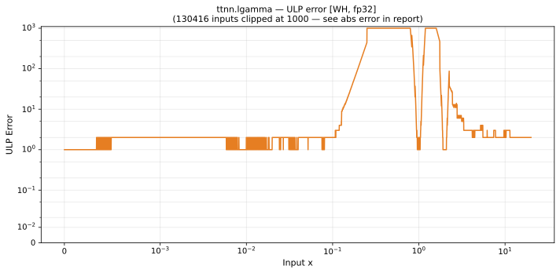

# lgamma — Wormhole (WH), float32
_This page is auto-generated by `ttnn-accuracy report`. Do not edit manually._

**Architecture:** Wormhole (WH)  
**Data type:** float32  

---

[← Wormhole (WH) float32 ops](README.md) | [All archs for lgamma](../../../by_op/lgamma/README.md) | [Top](../../../README.md)

**Measured input range:** x ∈ [-8.389e+06, 4.084e+36]  

|  | `default` |
|---|---|
| Max ULP | 3.27e+07 ⚠ |
| Min ULP | 0.512 |
| Mean ULP | 2.98e+03 |
| Signed bias (ULP) | -668 |
| p50 ULP | 0.677 |
| p95 ULP | 2.2 |
| p99 ULP | 182 |
| Exact fraction | 0 |
| Correctly rounded | 0.783 |
| Accurate to \|x\| | 0.0181 |
| Max abs error | 3.25e+31 |
| Max rel error | 2.06 |
| Median rel error | 6.66e-08 |
| Bits of precision (worst) | -1.04 |
| Bits of precision (median) | 23.8 |

**default** — accurate to |x| <= 0.0181  

**Outcomes**

| Parameters | faithful | inexact |
|---|---|---|
| `default` | 29,463 | 21,294 |

**Worst points**

| Parameters | x | golden | device | ULP |
|---|---|---|---|---|
| `default` | -2.4570248 | -1.12878425e-07 | 1.1920929e-07 | 3.27e+07 |
| `default` | -3.143581 | -1.9605461e-07 | -4.7683716e-07 | 1.98e+07 |
| `default` | -7.999975 | 0.00029724976 | 0.000579834 | 9.71e+06 |
| `default` | -4.9915447 | 9.666772e-06 | 1.7166138e-05 | 8.25e+06 |
| `default` | -2.7476828 | 3.1223516e-07 | 1.1920929e-07 | 6.79e+06 |
| `default` | -3.9552941 | -3.163176e-06 | -2.1457672e-06 | 4.47e+06 |
| `default` | -5.998607 | -0.00023018896 | -0.0002002716 | 2.06e+06 |
| `default` | -6.999801 | -0.0017559363 | -0.0015821457 | 1.49e+06 |
| `default` | 0.5386544 | 0.4999999 | 0.4655646 | 1.16e+06 |
| `default` | 0.53906256 | 0.4992719 | 0.46502978 | 1.15e+06 |

### Special values

| Variant | x | device | golden |  |
|---|---|---|---|---|
| `default` | 0 | inf | inf | agree |
| `default` | -0 | inf | inf | agree |
| `default` | inf | inf | inf | agree |
| `default` | -inf | inf | inf | agree |
| `default` | nan | nan | nan | agree |
| `default` | 1.1754944e-38 | 87.33655 | 87.33655 | agree |
| `default` | -1.1754944e-38 | 87.33655 | 87.33655 | agree |

_Measured on WORMHOLE_B0 · tt-metal `de546d3b146` · ttnn `0.79.0` · run `20261010T030007`_

