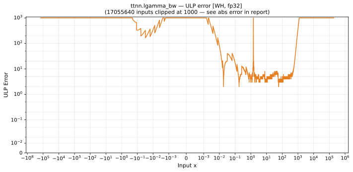

# lgamma_bw — Wormhole (WH), float32
_This page is auto-generated by `ttnn-accuracy report`. Do not edit manually._

**Architecture:** Wormhole (WH)  
**Data type:** float32  

---

[← Wormhole (WH) float32 ops](README.md) | [All archs for lgamma_bw](../../../by_op/lgamma_bw/README.md) | [Top](../../../README.md)

**Measured input range:** x ∈ [-8.389e+06, 3.403e+38]  

| Parameters | Max ULP | Mean ULP | Accurate to \|x\| | Max abs error |
|---|---|---|---|---------------|
| `default` | 3.66e+17 ⚠ | 7.77e+12 | nowhere | 8.51e+37 |

**default** — never within 2 ULP; mean 7.77e+12, worst 3.66e+17  

**Outcomes**

| Parameters | inexact | undefined |
|------------|------|------|
| `default` | 50,757 | 827 |

### Special values

| Variant | x | device | golden | |
|---|---|---|---|---|
| `default` | 0 | 6.68e+06 | -inf | **differ** |
| `default` | -0 | 6.68e+06 | inf | **differ** |
| `default` | inf | inf | inf | agree |
| `default` | -inf | nan | nan | agree |
| `default` | nan | 89.09 | nan | **differ** |
| `default` | 1.175e-38 | 6.68e+06 | -8.507e+37 | **differ** |
| `default` | -1.175e-38 | 6.68e+06 | 8.507e+37 | **differ** |

_Measured on WORMHOLE_B0 · tt-metal `9f9cd4fd590` · ttnn `0.77.0` · run `20260915T152226`_

