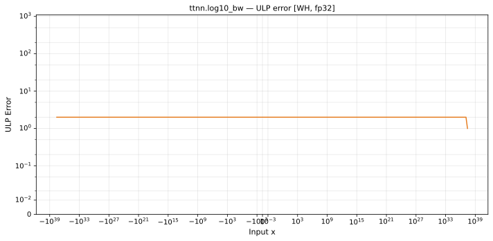

# log10_bw — Wormhole (WH), float32
_This page is auto-generated by `ttnn-accuracy report`. Do not edit manually._

**Architecture:** Wormhole (WH)  
**Data type:** float32  

---

[← Wormhole (WH) float32 ops](README.md) | [All archs for log10_bw](../../../by_op/log10_bw/README.md) | [Top](../../../README.md)

**Measured input range:** x ∈ [-3.692e+37, 3.692e+37]  

|  | `default` |
|---|---|
| Max ULP | 2.1 |
| Min ULP | 0.968 |
| Mean ULP | 1.41 |
| Signed bias (ULP) | 0 |
| p50 ULP | 1.31 |
| p95 ULP | 1.9 |
| p99 ULP | 2.04 |
| Exact fraction | 0 |
| Correctly rounded | 0.674 |
| Accurate to \|x\| | 2.04e-38 |
| Max abs error | 4.29e+30 |
| Max rel error | 1.26e-07 |
| Median rel error | 1.15e-07 |
| Bits of precision (worst) | 22.9 |
| Bits of precision (median) | 23.1 |

**default** — accurate to |x| <= 2.04e-38  

**Outcomes**

| Parameters | faithful | inexact |
|---|---|---|
| `default` | 4,016 | 60,174 |

**Worst points**

| Parameters | x | golden | device | ULP |
|---|---|---|---|---|
| `default` | 2.0460315e-38 | 2.1226187e+37 | 2.1226184e+37 | 2.1 |
| `default` | 4.092063e-38 | 1.06130934e+37 | 1.0613092e+37 | 2.1 |
| `default` | 8.184126e-38 | 5.3065467e+36 | 5.306546e+36 | 2.1 |
| `default` | 1.6368252e-37 | 2.6532734e+36 | 2.653273e+36 | 2.1 |
| `default` | 3.2736505e-37 | 1.3266367e+36 | 1.3266365e+36 | 2.1 |
| `default` | 6.547301e-37 | 6.6331834e+35 | 6.6331826e+35 | 2.1 |
| `default` | 1.3094602e-36 | 3.3165917e+35 | 3.3165913e+35 | 2.1 |
| `default` | 2.6189204e-36 | 1.65829585e+35 | 1.6582957e+35 | 2.1 |
| `default` | 5.2378408e-36 | 8.2914793e+34 | 8.2914783e+34 | 2.1 |
| `default` | 1.04756815e-35 | 4.1457396e+34 | 4.1457391e+34 | 2.1 |

**Monotonicity**

_Checked only where the reference is itself ordered, and never across a discontinuity._

| Parameters | Pairs | Violations | Rate | Worst \|Δy\| |
|---|---|---|---|---|
| `default` | 64,188 | 0 | 0 | 0 |

### Special values

| Variant | x | device | golden |  |
|---|---|---|---|---|
| `default` | 0 | inf | inf | agree |
| `default` | -0 | inf | -inf | **differ** |
| `default` | inf | 0 | 0 | agree |
| `default` | -inf | 0 | -0 | **differ** |
| `default` | nan | 0 | nan | **differ** |
| `default` | 1.1754944e-38 | 3.6945687e+37 | 3.694569e+37 | **differ** |
| `default` | -1.1754944e-38 | -3.6945687e+37 | -3.694569e+37 | **differ** |

_Measured on WORMHOLE_B0 · tt-metal `de546d3b146` · ttnn `0.79.0` · run `20261003T030514`_

