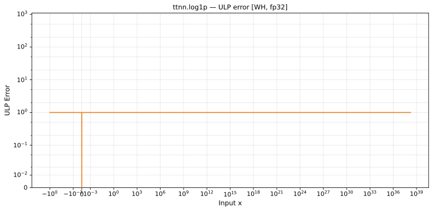

# log1p — Wormhole (WH), float32
_This page is auto-generated by `ttnn-accuracy report`. Do not edit manually._

**Architecture:** Wormhole (WH)  
**Data type:** float32  

---

[← Wormhole (WH) float32 ops](README.md) | [All archs for log1p](../../../by_op/log1p/README.md) | [Top](../../../README.md)

**Measured input range:** x ∈ [-1, 3.403e+38]  

|  | `default` |
|---|---|
| Max ULP | 0.984 |
| Min ULP | 0 |
| Mean ULP | 0.558 |
| Signed bias (ULP) | -0.462 |
| p50 ULP | 0.00303 |
| p95 ULP | 0.63 |
| p99 ULP | 0.67 |
| Exact fraction | 0.587 |
| Correctly rounded | 0.982 |
| Accurate to \|x\| | 3.39e+38 |
| Max abs error | 4.53e-06 |
| Max rel error | 8.96e-08 |
| Median rel error | 4.84e-08 |
| Bits of precision (worst) | 23.4 |
| Bits of precision (median) | 24.3 |

**default** — faithfully rounded; 20111 of 48640 points took the other neighbour  

**Outcomes**

| Parameters | exact | faithful |
|---|---|---|
| `default` | 28,529 | 20,111 |

**Worst points**

| Parameters | x | golden | device | ULP |
|---|---|---|---|---|
| `default` | 0.28316164 | 0.24932706 | 0.24932708 | 0.984 |
| `default` | 0.28116435 | 0.24776931 | 0.24776933 | 0.976 |
| `default` | -0.2926732 | -0.34626248 | -0.3462625 | 0.972 |
| `default` | 0.27912349 | 0.24617507 | 0.24617508 | 0.97 |
| `default` | 0.28323895 | 0.24938731 | 0.24938732 | 0.967 |
| `default` | 0.4808383 | 0.39260834 | 0.39260837 | 0.967 |
| `default` | -0.2943455 | -0.34862953 | -0.34862956 | 0.964 |
| `default` | -0.28543013 | -0.3360745 | -0.33607453 | 0.962 |
| `default` | -0.28784266 | -0.3394564 | -0.33945644 | 0.959 |
| `default` | -0.28949326 | -0.34177685 | -0.34177688 | 0.957 |

**Monotonicity**

_Checked only where the reference is itself ordered, and never across a discontinuity._

| Parameters | Pairs | Violations | Rate | Worst \|Δy\| |
|---|---|---|---|---|
| `default` | 48,638 | 0 | 0 | 0 |

### Special values

| Variant | x | device | golden |  |
|---|---|---|---|---|
| `default` | 0 | 0 | 0 | agree |
| `default` | -0 | 0 | -0 | **differ** |
| `default` | inf | inf | inf | agree |
| `default` | -inf | nan | nan | agree |
| `default` | nan | nan | nan | agree |
| `default` | 1.1754944e-38 | 1.1754944e-38 | 1.1754944e-38 | agree |
| `default` | -1.1754944e-38 | -1.1754944e-38 | -1.1754944e-38 | agree |

_Measured on WORMHOLE_B0 · tt-metal `a3a9fb4229a` · ttnn `0.78.0` · run `20260929T112230`_

