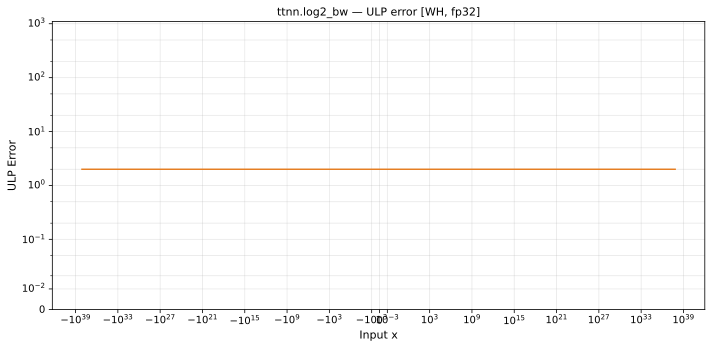

# log2_bw — Wormhole (WH), float32
_This page is auto-generated by `ttnn-accuracy report`. Do not edit manually._

**Architecture:** Wormhole (WH)  
**Data type:** float32  

---

[← Wormhole (WH) float32 ops](README.md) | [All archs for log2_bw](../../../by_op/log2_bw/README.md) | [Top](../../../README.md)

**Measured input range:** x ∈ [-1.227e+38, 1.227e+38]  

|  | `default` |
|---|---|
| Max ULP | 1.9 |
| Min ULP | 0.883 |
| Mean ULP | 1.3 |
| Signed bias (ULP) | 0 |
| p50 ULP | 1.31 |
| p95 ULP | 1.67 |
| p99 ULP | 1.88 |
| Exact fraction | 0 |
| Correctly rounded | 0.701 |
| Accurate to \|x\| | nowhere |
| Max abs error | 9.62e+30 |
| Max rel error | 1.13e-07 |
| Median rel error | 1.05e-07 |
| Bits of precision (worst) | 23.1 |
| Bits of precision (median) | 23.2 |

**default** — 112 of 64626 points returned inf or zero where a value exists  

**Outcomes**

| Parameters | faithful | inexact | mismatch |
|---|---|---|---|
| `default` | 8,066 | 56,448 | 112 |

**Worst points**

| Parameters | x | golden | device | ULP |
|---|---|---|---|---|
| `default` | 1.6986242e-38 | 8.4933153e+37 | 8.4933143e+37 | 1.9 |
| `default` | 3.3972483e-38 | 4.2466577e+37 | 4.2466571e+37 | 1.9 |
| `default` | 6.7944966e-38 | 2.1233288e+37 | 2.1233286e+37 | 1.9 |
| `default` | 1.3588993e-37 | 1.0616644e+37 | 1.0616643e+37 | 1.9 |
| `default` | 2.7177986e-37 | 5.308322e+36 | 5.3083214e+36 | 1.9 |
| `default` | 5.4355973e-37 | 2.654161e+36 | 2.6541607e+36 | 1.9 |
| `default` | 1.0871195e-36 | 1.3270805e+36 | 1.32708036e+36 | 1.9 |
| `default` | 2.174239e-36 | 6.6354026e+35 | 6.6354018e+35 | 1.9 |
| `default` | 4.348478e-36 | 3.3177013e+35 | 3.3177009e+35 | 1.9 |
| `default` | 8.696956e-36 | 1.6588506e+35 | 1.6588504e+35 | 1.9 |

**Monotonicity**

_Checked only where the reference is itself ordered, and never across a discontinuity._

| Parameters | Pairs | Violations | Rate | Worst \|Δy\| |
|---|---|---|---|---|
| `default` | 64,512 | 0 | 0 | 0 |

**Non-finite outputs**

| Parameters | Points | Both | Device only | Golden only | Device inf | Device nan | Golden inf | Golden nan |
|---|---|---|---|---|---|---|---|---|
| `default` | 112 | 0 | 112 | 0 | 112 | 0 | 0 | 0 |

| Parameters | x | golden | device |
|---|---|---|---|
| `default` | 1.1754944e-38 | 1.2273092e+38 | inf |
| `default` | 1.1846779e-38 | 1.2177952e+38 | inf |
| `default` | 1.1938615e-38 | 1.2084275e+38 | inf |
| `default` | 1.203045e-38 | 1.1992028e+38 | inf |
| `default` | 1.2122285e-38 | 1.190118e+38 | inf |
| `default` | 1.2214121e-38 | 1.1811698e+38 | inf |
| `default` | 1.2305956e-38 | 1.172355e+38 | inf |
| `default` | 1.2397792e-38 | 1.163671e+38 | inf |
| `default` | 1.2489627e-38 | 1.1551146e+38 | inf |
| `default` | 1.2581463e-38 | 1.1466831e+38 | inf |

### Special values

| Variant | x | device | golden |  |
|---|---|---|---|---|
| `default` | 0 | inf | inf | agree |
| `default` | -0 | inf | -inf | **differ** |
| `default` | inf | 0 | 0 | agree |
| `default` | -inf | 0 | -0 | **differ** |
| `default` | nan | 0 | nan | **differ** |
| `default` | 1.1754944e-38 | inf | 1.2273092e+38 | **differ** |
| `default` | -1.1754944e-38 | inf | -1.2273092e+38 | **differ** |

> **Provenance unknown.** These figures predate run tracking. Re-measure to attribute them.

