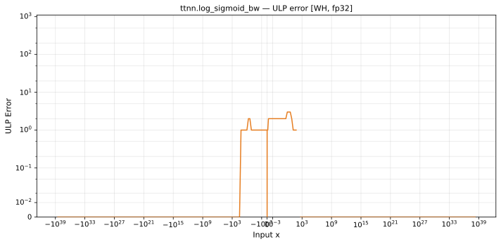

# log_sigmoid_bw — Wormhole (WH), float32
_This page is auto-generated by `ttnn-accuracy report`. Do not edit manually._

**Architecture:** Wormhole (WH)  
**Data type:** float32  

---

[← Wormhole (WH) float32 ops](README.md) | [All archs for log_sigmoid_bw](../../../by_op/log_sigmoid_bw/README.md) | [Top](../../../README.md)

**Measured input range:** x ∈ [-3.403e+38, 3.403e+38]  

|  | `default` |
|---|---|
| Max ULP | 2.95 |
| Min ULP | 0 |
| Mean ULP | 1.28 |
| Signed bias (ULP) | 0.308 |
| p50 ULP | 0 |
| p95 ULP | 1.25 |
| p99 ULP | 1.99 |
| Exact fraction | 0.898 |
| Correctly rounded | 0.954 |
| Accurate to \|x\| | 0.00164 |
| Max abs error | 8.99e-08 |
| Max rel error | 2.14e-07 |
| Median rel error | 1.07e-07 |
| Bits of precision (worst) | 22.2 |
| Bits of precision (median) | 23.2 |

**default** — accurate to |x| <= 0.00164; up to 2.95 ULP beyond  

**Outcomes**

| Parameters | exact | faithful | flushed | inexact |
|---|---|---|---|---|
| `default` | 58,014 | 2,574 | 395 | 4,041 |

**Worst points**

| Parameters | x | golden | device | ULP |
|---|---|---|---|---|
| `default` | 3.4381151 | 0.031125275 | 0.03112527 | 2.95 |
| `default` | 1.9821532 | 0.121089496 | 0.12108947 | 2.91 |
| `default` | 3.4354954 | 0.031204375 | 0.03120438 | 2.89 |
| `default` | 1.966874 | 0.12272505 | 0.122725025 | 2.87 |
| `default` | 4.8463917 | 0.00779543 | 0.0077954284 | 2.85 |
| `default` | 2.0143895 | 0.117700376 | 0.11770035 | 2.83 |
| `default` | 4.144894 | 0.015597962 | 0.015597965 | 2.81 |
| `default` | 2.7147784 | 0.062106926 | 0.062106937 | 2.79 |
| `default` | 2.767233 | 0.05912075 | 0.059120737 | 2.78 |
| `default` | 2.7633948 | 0.059334602 | 0.059334613 | 2.77 |

**Monotonicity**

_Checked only where the reference is itself ordered, and never across a discontinuity._

| Parameters | Pairs | Violations | Rate | Worst \|Δy\| |
|---|---|---|---|---|
| `default` | 64,626 | 128 | 0.00198 | 1e-07 |

_Worst violations — the device output moved against the reference's own direction between these neighbouring inputs._

| Parameters | x | device | \|Δy\| |
|---|---|---|---|
| `default` | -2.0712829e-05 → -2.0593618e-05 | 0.5000051 → 0.5000052 | 1e-07 |
| `default` | -1.3053416e-05 → -1.2964095e-05 | 0.5000032 → 0.5000033 | 1e-07 |
| `default` | -1.06692305e-05 → -1.0579881e-05 | 0.5000026 → 0.5000027 | 1e-07 |
| `default` | -8.285045e-06 → -8.195673e-06 | 0.500002 → 0.5000021 | 1e-07 |
| `default` | -5.424022e-06 → -5.364418e-06 | 0.5000013 → 0.5000014 | 1e-07 |

### Special values

| Variant | x | device | golden |  |
|---|---|---|---|---|
| `default` | 0 | 0.5 | 0.5 | agree |
| `default` | -0 | 0.5 | 0.5 | agree |
| `default` | inf | 0 | 0 | agree |
| `default` | -inf | 1 | 1 | agree |
| `default` | nan | nan | nan | agree |
| `default` | 1.1754944e-38 | 0.5 | 0.5 | agree |
| `default` | -1.1754944e-38 | 0.5 | 0.5 | agree |

> **Provenance unknown.** These figures predate run tracking. Re-measure to attribute them.

