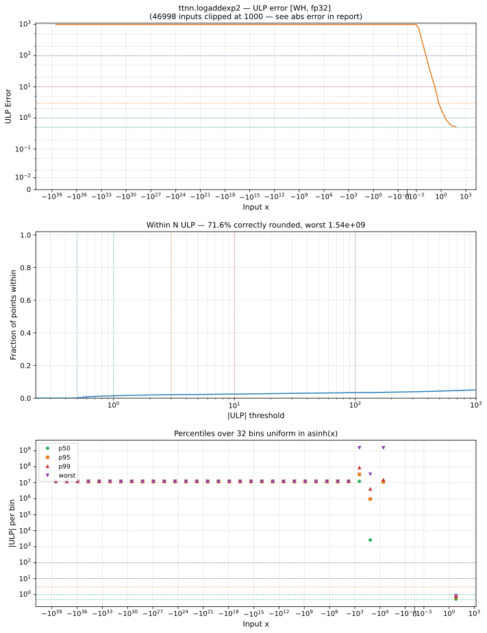

# logaddexp2 — Wormhole (WH), float32
_This page is auto-generated by `ttnn-accuracy report`. Do not edit manually._

**Architecture:** Wormhole (WH)  
**Data type:** float32  

---

[← Wormhole (WH) float32 ops](README.md) | [All archs for logaddexp2](../../../by_op/logaddexp2/README.md) | [Top](../../../README.md)

**Measured input range:** all normal values  

|  | `default` |
|---|---|
| Max ULP | 1.54e+09 ⚠ |
| Min ULP | 0.454 |
| Mean ULP | 1.05e+07 |
| Signed bias (ULP) | -1.6e+06 |
| p50 ULP | 1.13e+07 |
| p95 ULP | 1.21e+07 |
| p99 ULP | 1.41e+07 |
| Exact fraction | 0.00218 |
| Correctly rounded | 0.716 |
| Max abs error | 3.93e-06 |
| Max rel error | 161 |
| Median rel error | 0.869 |
| Bits of precision (worst) | -7.33 |
| Bits of precision (median) | 0.203 |

**default** — 15488 of 65024 points returned inf or zero where a value exists  

**Outcomes**

| Parameters | exact | faithful | inexact | mismatch |
|---|---|---|---|---|
| `default` | 108 | 641 | 48,787 | 15,488 |

**Worst points**

| Parameters | x | x2 | golden | device | ULP |
|---|---|---|---|---|---|
| `default` | -4.3045276e-08 | -25.016273 | -5.3187543e-10 | -8.5991324e-08 | 1.54e+09 |
| `default` | -25.016273 | -4.3045276e-08 | -5.3187543e-10 | -8.5991324e-08 | 1.54e+09 |
| `default` | -4.329731e-08 | -25.016273 | -7.839085e-10 | -8.5991324e-08 | 1.53e+09 |
| `default` | -4.3369788e-08 | -25.016273 | -8.563874e-10 | -8.5991324e-08 | 1.53e+09 |
| `default` | -4.3721414e-08 | -25.016273 | -1.2080137e-09 | -8.5991324e-08 | 7.64e+08 |
| `default` | -4.3862247e-08 | -25.016273 | -1.3488468e-09 | -8.5991324e-08 | 7.62e+08 |
| `default` | -4.4052594e-08 | -25.016273 | -1.5391941e-09 | -8.5991324e-08 | 7.61e+08 |
| `default` | -4.4334257e-08 | -25.016273 | -1.8208568e-09 | -8.5991324e-08 | 7.58e+08 |
| `default` | -4.4525972e-08 | -25.016273 | -2.0125719e-09 | -8.5991324e-08 | 3.78e+08 |
| `default` | -4.4798806e-08 | -25.016273 | -2.285406e-09 | -8.5991324e-08 | 3.77e+08 |

**Non-finite outputs**

| Parameters | Points | Both | Device only | Golden only | Device inf | Device nan | Golden inf | Golden nan |
|---|---|---|---|---|---|---|---|---|
| `default` | 15,488 | 0 | 15,488 | 0 | 15,488 | 0 | 0 | 0 |

| Parameters | x | x2 | golden | device |
|---|---|---|---|---|
| `default` | 128.82019 | 1.1837498e-38 | 128.82019 | inf |
| `default` | 129.71661 | 1.1837498e-38 | 129.71661 | inf |
| `default` | 130.9303 | 1.1837498e-38 | 130.9303 | inf |
| `default` | 131.06262 | 1.1837498e-38 | 131.06262 | inf |
| `default` | 132.53426 | 1.1837498e-38 | 132.53426 | inf |
| `default` | 133.55144 | 1.1837498e-38 | 133.55144 | inf |
| `default` | 134.94861 | 1.1837498e-38 | 134.94861 | inf |
| `default` | 135.20006 | 1.1837498e-38 | 135.20006 | inf |
| `default` | 136.74246 | 1.1837498e-38 | 136.74246 | inf |
| `default` | 137.09119 | 1.1837498e-38 | 137.09119 | inf |

### Special values

| Variant | x | device | golden |  |
|---|---|---|---|---|
| `default` | 0 | 1.5849625 | 1.5849625 | agree |
| `default` | -0 | 1.5849625 | 1.5849625 | agree |
| `default` | inf | inf | inf | agree |
| `default` | -inf | 1 | 1 | agree |
| `default` | nan | nan | nan | agree |
| `default` | 1.1754944e-38 | 1.5849625 | 1.5849625 | agree |
| `default` | -1.1754944e-38 | 1.5849625 | 1.5849625 | agree |

> **Sampled, not exhaustive.** For this op both operands take 65,536 of the 2³² fp32 values, drawn once from a fixed seed. The figures above are a lower bound on the error, and comparable between releases, but they are not a bound over the dtype.

> **Provenance unknown.** These figures predate run tracking. Re-measure to attribute them.

