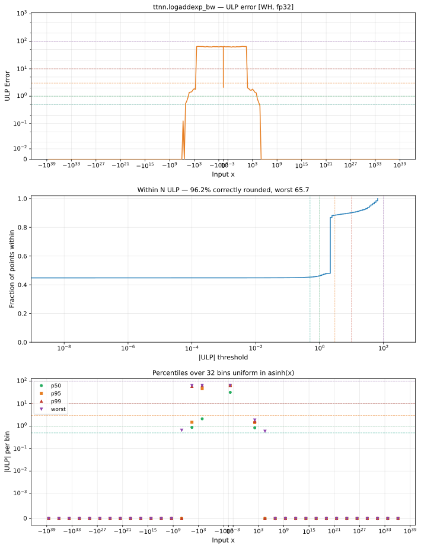

# logaddexp_bw — Wormhole (WH), float32
_This page is auto-generated by `ttnn-accuracy report`. Do not edit manually._

**Architecture:** Wormhole (WH)  
**Data type:** float32  

---

[← Wormhole (WH) float32 ops](README.md) | [All archs for logaddexp_bw](../../../by_op/logaddexp_bw/README.md) | [Top](../../../README.md)

**Measured input range:** all normal values  

|  | `default` |
|---|---|
| Max ULP | 65.7 |
| Min ULP | 0 |
| Mean ULP | 8.66 |
| Signed bias (ULP) | 1.7 |
| p50 ULP | 2.12 |
| p95 ULP | 36.9 |
| p99 ULP | 61.4 |
| Exact fraction | 0.454 |
| Correctly rounded | 0.962 |
| Max abs error | 1.09e-07 |
| Max rel error | 3.92e-06 |
| Median rel error | 1.27e-07 |
| Bits of precision (worst) | 18 |
| Bits of precision (median) | 22.9 |

**default** — worst pairing 65.7 ULP; mean 8.66  

**Outcomes**

| Parameters | exact | faithful | inexact |
|---|---|---|---|
| `default` | 29,495 | 709 | 34,820 |

**Worst points**

| Parameters | x | x2 | golden | device | ULP |
|---|---|---|---|---|---|
| `default` | 4.4432106 | 71.6801 | 6.30072e-30 | 6.3006952e-30 | 65.7 |
| `default` | -100.460175 | -35.996967 | 1.00921756e-28 | 1.00921365e-28 | 65.3 |
| `default` | -78.02297 | -13.5582695 | 1.00770956e-28 | 1.00770565e-28 | 65.1 |
| `default` | -33.33845 | 38.75045 | 4.9225242e-32 | 4.9225433e-32 | 65 |
| `default` | -23.794998 | 51.76057 | 1.5368569e-33 | 1.536851e-33 | 65 |
| `default` | 3.1196861 | 82.83787 | 2.392399e-35 | 2.3923897e-35 | 64.9 |
| `default` | -4.3922195 | 61.457737 | 2.5218965e-29 | 2.5218867e-29 | 64.9 |
| `default` | -47.883503 | 35.29998 | 7.4794953e-37 | 7.479466e-37 | 64.9 |
| `default` | -18.940369 | 55.226574 | 6.1617787e-33 | 6.1617548e-33 | 64.9 |
| `default` | 43.28616 | 127.850464 | 1.8801359e-37 | 1.8801432e-37 | 64.9 |

### Special values

| Variant | x | device | golden |  |
|---|---|---|---|---|
| `default` | 0 | 0.26894143 | 0.26894143 | agree |
| `default` | -0 | 0.26894143 | 0.26894143 | agree |
| `default` | inf | 1 | 1 | agree |
| `default` | -inf | 0 | 0 | agree |
| `default` | nan | 0 | nan | **differ** |
| `default` | 1.1754944e-38 | 0.26894143 | 0.26894143 | agree |
| `default` | -1.1754944e-38 | 0.26894143 | 0.26894143 | agree |

> **Sampled, not exhaustive.** For this op both operands take 65,536 of the 2³² fp32 values, drawn once from a fixed seed. The figures above are a lower bound on the error, and comparable between releases, but they are not a bound over the dtype.

> **Provenance unknown.** These figures predate run tracking. Re-measure to attribute them.

