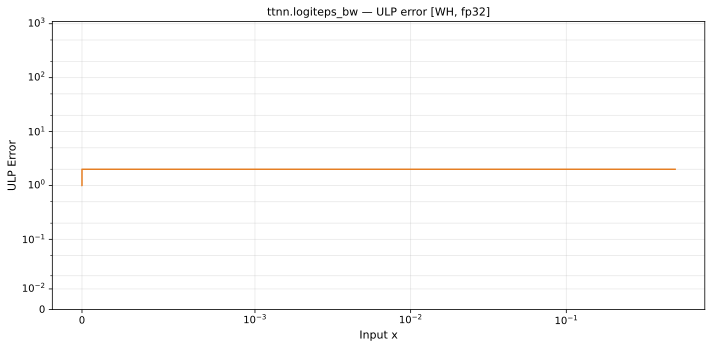

# logiteps_bw — Wormhole (WH), float32
_This page is auto-generated by `ttnn-accuracy report`. Do not edit manually._

**Architecture:** Wormhole (WH)  
**Data type:** float32  

---

[← Wormhole (WH) float32 ops](README.md) | [All archs for logiteps_bw](../../../by_op/logiteps_bw/README.md) | [Top](../../../README.md)

**Measured input range:** x ∈ [min\_normal, 1]  

| Parameters | Max ULP | Mean ULP | Accurate to \|x\| | Max abs error |
|---|---|---|---|---------------|
| `default` | 2 | 1.06 | 0.998 | 5.07e+30 |

**default** — within 2 ULP everywhere  

**Outcomes**

| Parameters | inexact |
|------------|------|
| `default` | 16,128 |

### Special values

| Variant | x | device | golden | |
|---|---|---|---|---|
| `default` | 0 | inf | inf | agree |
| `default` | -0 | inf | -inf | **differ** |
| `default` | inf | 0 | nan | **differ** |
| `default` | -inf | 0 | nan | **differ** |
| `default` | nan | 0 | nan | **differ** |
| `default` | 1.175e-38 | 8.507e+37 | 8.507e+37 | agree |
| `default` | -1.175e-38 | 0 | nan | **differ** |

_Measured on WORMHOLE_B0 · tt-metal `71e0727d990` · ttnn `0.1.dev30578+g5b8d933` · run `20260903T124708`_

