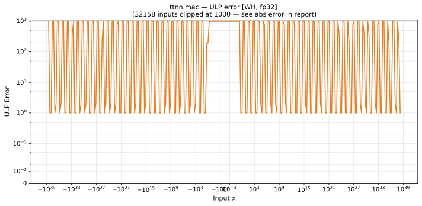

# mac — Wormhole (WH), float32
_This page is auto-generated by `ttnn-accuracy report`. Do not edit manually._

**Architecture:** Wormhole (WH)  
**Data type:** float32  

---

[← Wormhole (WH) float32 ops](README.md) | [All archs for mac](../../../by_op/mac/README.md) | [Top](../../../README.md)

**Measured input range:** all normal values  

|  | `default` |
|---|---|
| Max ULP | 4.22e+06 ⚠ |
| Min ULP | 1 |
| Mean ULP | 7.31e+05 |
| Signed bias (ULP) | 5.92e+05 |
| p50 ULP | 24 |
| p95 ULP | 3.36e+06 |
| p99 ULP | 4.04e+06 |
| Exact fraction | 0 |
| Correctly rounded | 0.974 |
| Max abs error | 3.8e+30 |
| Max rel error | 0.375 |
| Median rel error | 1.48e-06 |
| Bits of precision (worst) | 1.42 |
| Bits of precision (median) | 19.4 |

**default** — worst sampled pairing  

**Outcomes**

| Parameters | inexact |
|---|---|
| `default` | 65,024 |

**Worst points**

| Parameters | x | x2 | x3 | golden | device | ULP |
|---|---|---|---|---|---|---|
| `default` | 7.2714118e-12 | 8.139519e-28 | 1.1837498e-38 | 1.7756078e-38 | 1.1837498e-38 | 4.22e+06 |
| `default` | 1.6154226e-27 | 3.6633843e-12 | 1.1837498e-38 | 1.7755411e-38 | 1.1837498e-38 | 4.22e+06 |
| `default` | 0.49967596 | 1.1837498e-38 | 1.1837498e-38 | 1.7752411e-38 | 1.1837498e-38 | 4.22e+06 |
| `default` | 2.462877e-32 | 2.400985e-07 | 1.1837498e-38 | 1.7750829e-38 | 1.1837498e-38 | 4.22e+06 |
| `default` | 4.3357972e-19 | 1.363732e-20 | 1.1837498e-38 | 1.7750364e-38 | 1.1837498e-38 | 4.22e+06 |
| `default` | -2.775557e-17 | -2.1300658e-22 | 1.1837498e-38 | 1.7749617e-38 | 1.1837498e-38 | 4.22e+06 |
| `default` | -1.7338513e-18 | -3.409481e-21 | 1.1837498e-38 | 1.7749031e-38 | 1.1837498e-38 | 4.22e+06 |
| `default` | 1.0093598e-28 | 5.855944e-11 | 1.1837498e-38 | 1.7748252e-38 | 1.1837498e-38 | 4.22e+06 |
| `default` | -2.6456525e-23 | -2.233447e-16 | 1.1837498e-38 | 1.7746422e-38 | 1.1837498e-38 | 4.22e+06 |
| `default` | -0.12495166 | -4.7278667e-38 | 1.1837498e-38 | 1.7745046e-38 | 1.1837498e-38 | 4.22e+06 |

### Special values

| Variant | x | device | golden |  |
|---|---|---|---|---|
| `default` | 0 | 1 | 1 | agree |
| `default` | -0 | 1 | 1 | agree |
| `default` | inf | inf | inf | agree |
| `default` | -inf | -inf | -inf | agree |
| `default` | nan | nan | nan | agree |
| `default` | 1.1754944e-38 | 1 | 1 | agree |
| `default` | -1.1754944e-38 | 1 | 1 | agree |

> **Sampled, not exhaustive.** For this op the first operand takes 65,536 of the 2³² fp32 values, drawn once from a fixed seed; the second and third take every 512th of that sample. The figures above are a lower bound on the error, and comparable between releases, but they are not a bound over the dtype.

_Measured on WORMHOLE_B0 · tt-metal `de546d3b146` · ttnn `0.79.0` · run `20261010T025808`_

