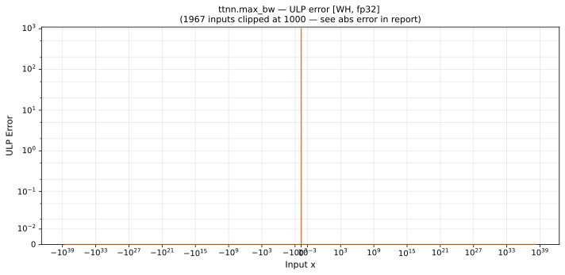

# max_bw — Wormhole (WH), float32
_This page is auto-generated by `ttnn-accuracy report`. Do not edit manually._

**Architecture:** Wormhole (WH)  
**Data type:** float32  

---

[← Wormhole (WH) float32 ops](README.md) | [All archs for max_bw](../../../by_op/max_bw/README.md) | [Top](../../../README.md)

**Measured input range:** all normal values  

|  | `default` |
|---|---|
| Max ULP | 4.19e+06 ⚠ |
| Min ULP | 0 |
| Mean ULP | 4.19e+06 |
| Signed bias (ULP) | 4.19e+06 |
| p50 ULP | 0 |
| p95 ULP | 0 |
| p99 ULP | 4.19e+06 |
| Exact fraction | 0.97 |
| Correctly rounded | 1 |
| Max abs error | 0.5 |
| Max rel error | 0.5 |
| Median rel error | 0.5 |
| Bits of precision (worst) | 1 |
| Bits of precision (median) | 1 |

**default** — worst pairing 4.19e+06 ULP; mean 4.19e+06  

**Outcomes**

| Parameters | exact | inexact |
|---|---|---|
| `default` | 63,057 | 1,967 |

**Worst points**

| Parameters | x | x2 | golden | device | ULP |
|---|---|---|---|---|---|
| `default` | 1.187421e-38 | 1.1837498e-38 | 1 | 0.5 | 4.19e+06 |
| `default` | 1.2021456e-38 | 1.1837498e-38 | 1 | 0.5 | 4.19e+06 |
| `default` | 1.2092162e-38 | 1.1837498e-38 | 1 | 0.5 | 4.19e+06 |
| `default` | 1.2204055e-38 | 1.1837498e-38 | 1 | 0.5 | 4.19e+06 |
| `default` | 1.2232443e-38 | 1.1837498e-38 | 1 | 0.5 | 4.19e+06 |
| `default` | 1.237559e-38 | 1.1837498e-38 | 1 | 0.5 | 4.19e+06 |
| `default` | 1.2484311e-38 | 1.1837498e-38 | 1 | 0.5 | 4.19e+06 |
| `default` | 1.2494089e-38 | 1.1837498e-38 | 1 | 0.5 | 4.19e+06 |
| `default` | 1.2614992e-38 | 1.1837498e-38 | 1 | 0.5 | 4.19e+06 |
| `default` | 1.2731752e-38 | 1.1837498e-38 | 1 | 0.5 | 4.19e+06 |

### Special values

| Variant | x | device | golden |  |
|---|---|---|---|---|
| `default` | 0 | 0 | 0 | agree |
| `default` | -0 | 0 | 0 | agree |
| `default` | inf | 1 | 1 | agree |
| `default` | -inf | 0 | 0 | agree |
| `default` | nan | 0 | 1 | **differ** |
| `default` | 1.1754944e-38 | 0 | 0 | agree |
| `default` | -1.1754944e-38 | 0 | 0 | agree |

> **Sampled, not exhaustive.** For this op both operands take 65,536 of the 2³² fp32 values, drawn once from a fixed seed. The figures above are a lower bound on the error, and comparable between releases, but they are not a bound over the dtype.

_Measured on WORMHOLE_B0 · tt-metal `a3a9fb4229a` · ttnn `0.78.0` · run `20260917T224646`_

