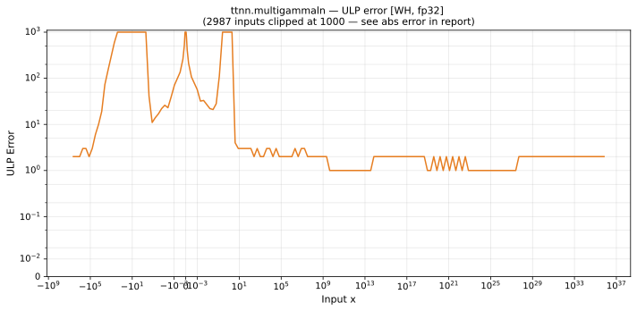

# multigammaln — Wormhole (WH), float32
_This page is auto-generated by `ttnn-accuracy report`. Do not edit manually._

_Generated: 2026-08-31 10:49_

**Architecture:** Wormhole (WH)  
**Data type:** float32  

---

[← Wormhole (WH) float32 ops](README.md) | [All archs for multigammaln](../../../by_op/multigammaln/README.md) | [Top](../../../README.md)

**Measured input range:** x ∈ [-4.194e+06, 1.038e+36]  

| Parameters | Max ULP | Mean ULP | Accurate to \|x\| | Max abs error |
|---|---|---|---|---------------|
| `default` | 3.51e+07 ⚠ | 9.16e+03 | 2.98e-08 | 4.06e+31 |

**default** — accurate to |x| <= 2.98e-08; up to 3.51e+07 ULP beyond  

**Outcomes**

| Parameters | inexact | mismatch | overflow |
|------------|------|------|------|
| `default` | 22,197 | 7,478 | 20,701 |

_Measured on WORMHOLE_B0 · tt-metal `2adf8c65887` · ttnn `0.75.0rc10.dev817+g2adf8c65887` · run `20260831T073009`_

