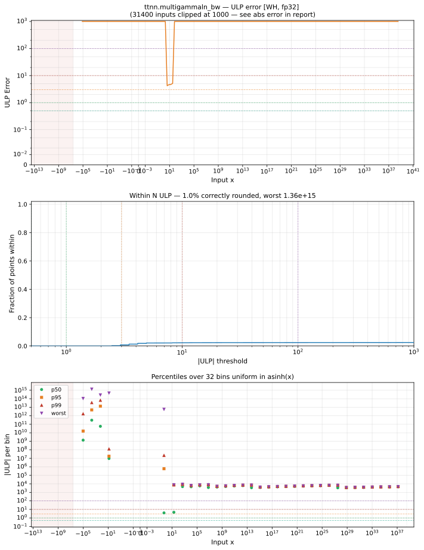

# multigammaln_bw — Wormhole (WH), float32
_This page is auto-generated by `ttnn-accuracy report`. Do not edit manually._

_Generated: 2026-08-31 08:49_

**Architecture:** Wormhole (WH)  
**Data type:** float32  

---

[← Wormhole (WH) float32 ops](README.md) | [All archs for multigammaln_bw](../../../by_op/multigammaln_bw/README.md) | [Top](../../../README.md)

**Measured input range:** x ∈ [-4.194e+06, 3.403e+38]  

| Parameters | Max ULP | Mean ULP | Accurate to \|x\| | Max abs error |
|---|---|---|---|---------------|
| `default` | 1.36e+15 ⚠ | 2.04e+11 | 5.55e-17 | 2.36e+16 |

**default** — accurate to |x| <= 5.55e-17; up to 1.36e+15 ULP beyond  

**Outcomes**

| Parameters | inexact | mismatch | zeroed |
|------------|------|------|------|
| `default` | 30,715 | 20,740 | 1 |

### Special values

| Variant | x | device | golden | |
|---|---|---|---|---|
| `default` | 0 | 6.68e+06 | nan | **differ** |
| `default` | -0 | 6.68e+06 | nan | **differ** |
| `default` | inf | inf | inf | agree |
| `default` | -inf | nan | nan | agree |
| `default` | nan | 355.2 | nan | **differ** |
| `default` | 1.175e-38 | 6.68e+06 | nan | **differ** |
| `default` | -1.175e-38 | 6.68e+06 | nan | **differ** |

_Measured on WORMHOLE_B0 · tt-metal `2adf8c65887` · ttnn `0.75.0rc10.dev817+g2adf8c65887` · run `20260831T073009`_

