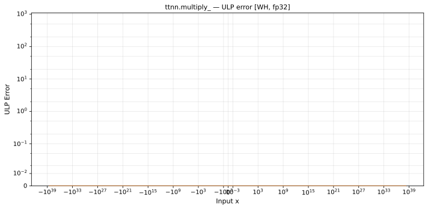

# multiply_ — Wormhole (WH), float32
_This page is auto-generated by `ttnn-accuracy report`. Do not edit manually._

**Architecture:** Wormhole (WH)  
**Data type:** float32  

---

[← Wormhole (WH) float32 ops](README.md) | [All archs for multiply_](../../../by_op/multiply_/README.md) | [Top](../../../README.md)

**Measured input range:** all normal values  

|  | `default` |
|---|---|
| Max ULP | 0.5 |
| Min ULP | 0.5 |
| Mean ULP | 0 |
| Signed bias (ULP) | 0 |
| p50 ULP | 0.5 |
| p95 ULP | 0.5 |
| p99 ULP | 0.5 |
| Exact fraction | 1 |
| Correctly rounded | 1 |
| Max abs error | 1.01e+31 |
| Max rel error | 5.96e-08 |
| Median rel error | 0 |
| Bits of precision (worst) | 24 |
| Bits of precision (median) | — |

**default** — bit-exact  

**Outcomes**

| Parameters | exact |
|---|---|
| `default` | 65,024 |

**Worst points**

| Parameters | x | x2 | golden | device | ULP |
|---|---|---|---|---|---|
| `default` | 1.8930937e-38 | -3.194382e+10 | -6.047264e-28 | -6.047264e-28 | 0.5 |
| `default` | 2.511961e-38 | -3.194382e+10 | -8.0241627e-28 | -8.0241627e-28 | 0.5 |
| `default` | 4.921719e-38 | -3.194382e+10 | -1.572185e-27 | -1.572185e-27 | 0.5 |
| `default` | 5.406815e-38 | 26.478516 | 1.4316444e-36 | 1.4316444e-36 | 0.5 |
| `default` | 9.866863e-38 | -3.95137e+13 | -3.8987628e-24 | -3.8987628e-24 | 0.5 |
| `default` | 1.0679535e-37 | -3.194382e+10 | -3.4114513e-27 | -3.4114513e-27 | 0.5 |
| `default` | 1.914935e-37 | -3.194382e+10 | -6.117034e-27 | -6.117034e-27 | 0.5 |
| `default` | 2.3308566e-37 | -3.194382e+10 | -7.445647e-27 | -7.445647e-27 | 0.5 |
| `default` | 2.4746796e-37 | -3.95137e+13 | -9.778374e-24 | -9.778374e-24 | 0.5 |
| `default` | 3.816009e-37 | -3.194382e+10 | -1.218979e-26 | -1.218979e-26 | 0.5 |

### Special values

| Variant | x | device | golden |  |
|---|---|---|---|---|
| `default` | 0 | 0 | 0 | agree |
| `default` | -0 | 0 | -0 | **differ** |
| `default` | inf | inf | inf | agree |
| `default` | -inf | -inf | -inf | agree |
| `default` | nan | nan | nan | agree |
| `default` | 1.1754944e-38 | 1.1754944e-38 | 1.1754944e-38 | agree |
| `default` | -1.1754944e-38 | -1.1754944e-38 | -1.1754944e-38 | agree |

> **Sampled, not exhaustive.** For this op both operands take 65,536 of the 2³² fp32 values, drawn once from a fixed seed. The figures above are a lower bound on the error, and comparable between releases, but they are not a bound over the dtype.

_Measured on WORMHOLE_B0 · tt-metal `de546d3b146` · ttnn `0.79.0` · run `20261003T030142`_

