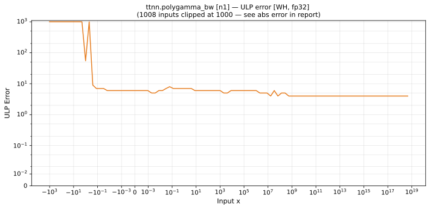

# polygamma_bw — Wormhole (WH), float32
_This page is auto-generated by `ttnn-accuracy report`. Do not edit manually._

**Architecture:** Wormhole (WH)  
**Data type:** float32  

---

[← Wormhole (WH) float32 ops](README.md) | [All archs for polygamma_bw](../../../by_op/polygamma_bw/README.md) | [Top](../../../README.md)

**Measured input range:** x ≥ -1024  

| Parameters | Max ULP | Mean ULP | Accurate to \|x\| | Max abs error |
|---|---|---|---|---------------|
| `n=1` | 4.45e+30 ⚠ | 4.42e+26 | 1.79e-13 | 2.99e+38 |

**n=1** — 75 of 49922 points returned inf or zero where a value exists · _trigamma; swept above -1024, where torch can still compute the reference_  

**Outcomes**

| Parameters | flushed | inexact | mismatch | overflow | zeroed |
|------------|------|------|------|------|------|
| `n=1` | 8,319 | 20,128 | 2 | 21,398 | 75 |

### Special values

| Variant | x | device | golden | |
|---|---|---|---|---|
| `n=1` | 0 | -inf | -inf | agree |
| `n=1` | -0 | -inf | -inf | agree |
| `n=1` | inf | 0 | nan | **differ** |
| `n=1` | -inf | 0 | -inf | **differ** |
| `n=1` | nan | 0 | nan | **differ** |
| `n=1` | 1.175e-38 | -inf | -inf | agree |
| `n=1` | -1.175e-38 | inf | inf | agree |

_Measured on WORMHOLE_B0 · tt-metal `812427269cb` · ttnn `0.1.dev30578+g5b8d933` · run `20260902T135808`_

