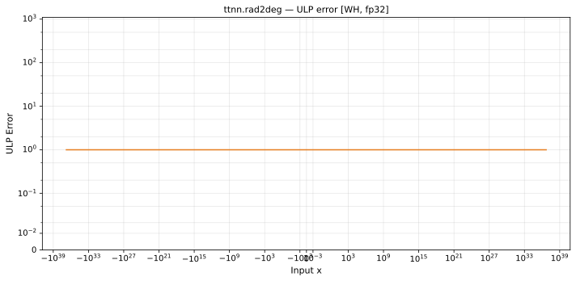

# rad2deg — Wormhole (WH), float32
_This page is auto-generated by `ttnn-accuracy report`. Do not edit manually._

**Architecture:** Wormhole (WH)  
**Data type:** float32  

---

[← Wormhole (WH) float32 ops](README.md) | [All archs for rad2deg](../../../by_op/rad2deg/README.md) | [Top](../../../README.md)

**Measured input range:** x ∈ [-5.931e+36, 5.931e+36]  

|  | `default` |
|---|---|
| Max ULP | 0.696 |
| Min ULP | 0.598 |
| Mean ULP | 0.643 |
| Signed bias (ULP) | 0 |
| p50 ULP | 0.642 |
| p95 ULP | 0.687 |
| p99 ULP | 0.694 |
| Exact fraction | 0 |
| Correctly rounded | 0.858 |
| Accurate to \|x\| | 5.93e+36 |
| Max abs error | 1.41e+31 |
| Max rel error | 7.09e-08 |
| Median rel error | 5.27e-08 |
| Bits of precision (worst) | 23.7 |
| Bits of precision (median) | 24.2 |

**default** — faithful; 63518/63518 tie-breaks  

**Outcomes**

| Parameters | faithful |
|---|---|
| `default` | 63,518 |

**Worst points**

| Parameters | x | golden | device | ULP |
|---|---|---|---|---|
| `default` | 1.3124556e-38 | 7.5198164e-37 | 7.519817e-37 | 0.696 |
| `default` | 2.6249112e-38 | 1.5039633e-36 | 1.5039634e-36 | 0.696 |
| `default` | 5.2498223e-38 | 3.0079266e-36 | 3.0079267e-36 | 0.696 |
| `default` | 1.0499645e-37 | 6.015853e-36 | 6.0158535e-36 | 0.696 |
| `default` | 2.099929e-37 | 1.2031706e-35 | 1.2031707e-35 | 0.696 |
| `default` | 4.199858e-37 | 2.4063413e-35 | 2.4063414e-35 | 0.696 |
| `default` | 8.399716e-37 | 4.8126825e-35 | 4.8126828e-35 | 0.696 |
| `default` | 1.6799431e-36 | 9.625365e-35 | 9.6253656e-35 | 0.696 |
| `default` | 3.3598863e-36 | 1.925073e-34 | 1.9250731e-34 | 0.696 |
| `default` | 6.7197726e-36 | 3.850146e-34 | 3.8501462e-34 | 0.696 |

**Monotonicity**

_Checked only where the reference is itself ordered, and never across a discontinuity._

| Parameters | Pairs | Violations | Rate | Worst \|Δy\| |
|---|---|---|---|---|
| `default` | 63,516 | 0 | 0 | 0 |

### Special values

| Variant | x | device | golden |  |
|---|---|---|---|---|
| `default` | 0 | 0 | 0 | agree |
| `default` | -0 | 0 | -0 | **differ** |
| `default` | inf | inf | inf | agree |
| `default` | -inf | -inf | -inf | agree |
| `default` | nan | nan | nan | agree |
| `default` | 1.1754944e-38 | 6.7350866e-37 | 6.7350866e-37 | agree |
| `default` | -1.1754944e-38 | -6.7350866e-37 | -6.7350866e-37 | agree |

_Measured on WORMHOLE_B0 · tt-metal `de546d3b146` · ttnn `0.79.0` · run `20261010T030007`_

