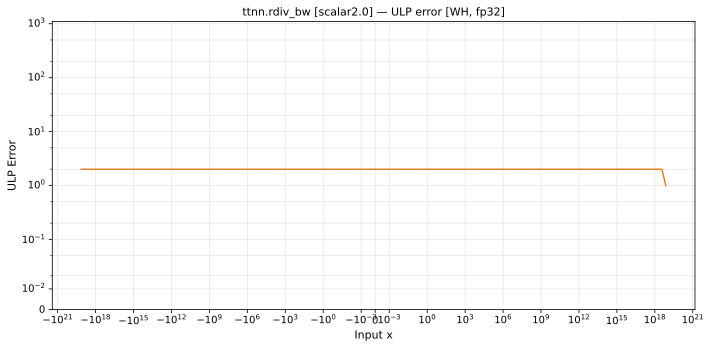

# rdiv_bw — Wormhole (WH), float32
_This page is auto-generated by `ttnn-accuracy report`. Do not edit manually._

_Generated: 2026-09-01 13:48_

**Architecture:** Wormhole (WH)  
**Data type:** float32  

---

[← Wormhole (WH) float32 ops](README.md) | [All archs for rdiv_bw](../../../by_op/rdiv_bw/README.md) | [Top](../../../README.md)

**Measured input range:** x ∈ [-1.303e+19, 1.303e+19]  

| Parameters | Max ULP | Mean ULP | Accurate to \|x\| | Max abs error |
|---|---|---|---|---------------|
| `scalar=2.0` | 2 | 1.14 | 1.3e+19 | 2.03e+31 |

**scalar=2.0** — within 2 ULP everywhere · _2 keeps the op distinct from reciprocal_  

**Outcomes**

| Parameters | exact | inexact | mismatch | overflow | zeroed |
|------------|------|------|------|------|------|
| `scalar=2.0` | 2 | 32,256 | 148 | 15,980 | 104 |

### Special values

| Variant | x | device | golden | |
|---|---|---|---|---|
| `scalar=2.0` | 0 | -inf | -inf | agree |
| `scalar=2.0` | -0 | -inf | -inf | agree |
| `scalar=2.0` | inf | 0 | -0 | **differ** |
| `scalar=2.0` | -inf | 0 | -0 | **differ** |
| `scalar=2.0` | nan | 0 | nan | **differ** |
| `scalar=2.0` | 1.175e-38 | -inf | -inf | agree |
| `scalar=2.0` | -1.175e-38 | -inf | -inf | agree |

_Measured on WORMHOLE_B0 · tt-metal `047ec3ccf96` · ttnn `0.1.dev30578+g5b8d933` · run `20260901T075510`_

