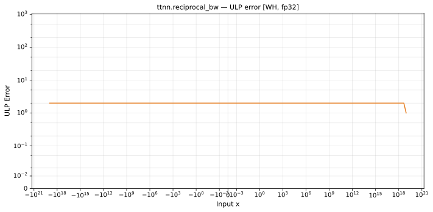

# reciprocal_bw — Wormhole (WH), float32
_This page is auto-generated by `ttnn-accuracy report`. Do not edit manually._

**Architecture:** Wormhole (WH)  
**Data type:** float32  

---

[← Wormhole (WH) float32 ops](README.md) | [All archs for reciprocal_bw](../../../by_op/reciprocal_bw/README.md) | [Top](../../../README.md)

**Measured input range:** x ∈ [-9.223e+18, 9.223e+18]  

|  | `default` |
|---|---|
| Max ULP | 1.84 |
| Min ULP | 0 |
| Mean ULP | 1.22 |
| Signed bias (ULP) | -0.754 |
| p50 ULP | 1.12 |
| p95 ULP | 1.64 |
| p99 ULP | 1.8 |
| Exact fraction | 6.2e-05 |
| Correctly rounded | 0.726 |
| Accurate to \|x\| | 5.42e-20 |
| Max abs error | 9.15e+30 |
| Max rel error | 1.11e-07 |
| Median rel error | 1.02e-07 |
| Bits of precision (worst) | 23.1 |
| Bits of precision (median) | 23.2 |

**default** — 254 of 48386 points returned inf or zero where a value exists; the rest reach 1.84 ULP  

**Outcomes**

| Parameters | exact | faithful | inexact | mismatch | overflow |
|---|---|---|---|---|---|
| `default` | 2 | 5,544 | 26,712 | 254 | 15,874 |

**Worst points**

| Parameters | x | golden | device | ULP |
|---|---|---|---|---|
| `default` | 1.534282e-19 | -4.24805e+37 | -4.2480495e+37 | 1.84 |
| `default` | 3.068564e-19 | -1.0620125e+37 | -1.0620124e+37 | 1.84 |
| `default` | 6.137128e-19 | -2.6550313e+36 | -2.655031e+36 | 1.84 |
| `default` | 1.2274256e-18 | -6.637578e+35 | -6.6375774e+35 | 1.84 |
| `default` | 2.4548512e-18 | -1.6593945e+35 | -1.6593943e+35 | 1.84 |
| `default` | 4.9097024e-18 | -4.1484864e+34 | -4.1484859e+34 | 1.84 |
| `default` | 9.819405e-18 | -1.0371216e+34 | -1.03712147e+34 | 1.84 |
| `default` | 1.963881e-17 | -2.592804e+33 | -2.5928037e+33 | 1.84 |
| `default` | 3.927762e-17 | -6.48201e+32 | -6.482009e+32 | 1.84 |
| `default` | 7.855524e-17 | -1.6205025e+32 | -1.6205023e+32 | 1.84 |

**Monotonicity**

_Checked only where the reference is itself ordered, and never across a discontinuity._

| Parameters | Pairs | Violations | Rate | Worst \|Δy\| |
|---|---|---|---|---|
| `default` | 32,256 | 0 | 0 | 0 |

**Non-finite outputs**

| Parameters | Points | Both | Device only | Golden only | Device inf | Device nan | Golden inf | Golden nan |
|---|---|---|---|---|---|---|---|---|
| `default` | 16,128 | 15,874 | 254 | 0 | 16,128 | 0 | 15,874 | 0 |

| Parameters | x | golden | device |
|---|---|---|---|
| `default` | 1.1754944e-38 | -inf | -inf |
| `default` | 1.1846779e-38 | -inf | -inf |
| `default` | 1.1938615e-38 | -inf | -inf |
| `default` | 1.203045e-38 | -inf | -inf |
| `default` | 1.2122285e-38 | -inf | -inf |
| `default` | 1.2214121e-38 | -inf | -inf |
| `default` | 1.2305956e-38 | -inf | -inf |
| `default` | 1.2397792e-38 | -inf | -inf |
| `default` | 1.2489627e-38 | -inf | -inf |
| `default` | 1.2581463e-38 | -inf | -inf |

### Special values

| Variant | x | device | golden |  |
|---|---|---|---|---|
| `default` | 0 | -inf | -inf | agree |
| `default` | -0 | -inf | -inf | agree |
| `default` | inf | 0 | -0 | **differ** |
| `default` | -inf | 0 | -0 | **differ** |
| `default` | nan | 0 | nan | **differ** |
| `default` | 1.1754944e-38 | -inf | -inf | agree |
| `default` | -1.1754944e-38 | -inf | -inf | agree |

_Measured on WORMHOLE_B0 · tt-metal `a3a9fb4229a` · ttnn `0.78.0` · run `20260929T111615`_

