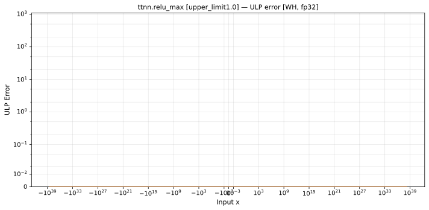
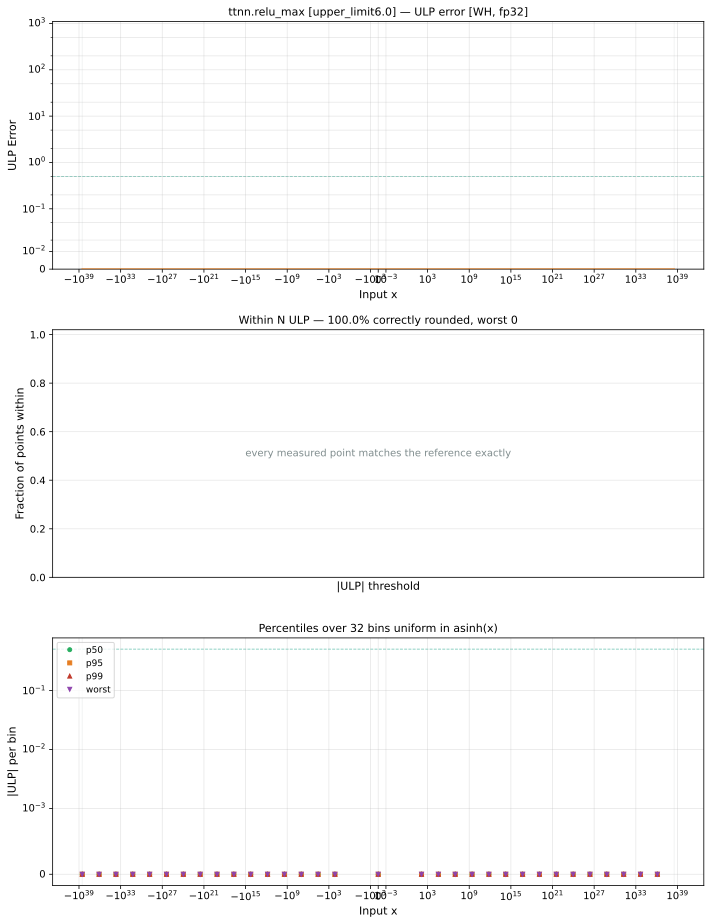

# relu_max — Wormhole (WH), float32
_This page is auto-generated by `ttnn-accuracy report`. Do not edit manually._

**Architecture:** Wormhole (WH)  
**Data type:** float32  

---

[← Wormhole (WH) float32 ops](README.md) | [All archs for relu_max](../../../by_op/relu_max/README.md) | [Top](../../../README.md)

**Measured input range:** x ∈ [-3.403e+38, 3.403e+38]  

|  | `upper_limit=0.0` | `upper_limit=1.0` | `upper_limit=6.0` |
|---|---|---|---|
| Max ULP | 0 | 0 | 0 |
| Min ULP | 0 | 0 | 0 |
| Mean ULP | 0 | 0 | 0 |
| Signed bias (ULP) | 0 | 0 | 0 |
| p50 ULP | 0 | 0 | 0 |
| p95 ULP | 0 | 0 | 0 |
| p99 ULP | 0 | 0 | 0 |
| Exact fraction | 1 | 1 | 1 |
| Correctly rounded | 1 | 1 | 1 |
| Accurate to \|x\| | 3.39e+38 | 3.39e+38 | 3.39e+38 |
| Max abs error | 0 | 0 | 0 |
| Max rel error | — | 0 | 0 |
| Median rel error | — | 0 | 0 |
| Bits of precision (worst) | — | — | — |
| Bits of precision (median) | — | — | — |

**upper_limit=0.0** — bit-exact · _degenerates to a constant zero_  
**upper_limit=1.0** — bit-exact · _unit clamp, the registry's midpoint_  
**upper_limit=6.0** — bit-exact · _relu6, the clamp models actually use_  

**Outcomes**

| Parameters | exact |
|---|---|
| `upper_limit=0.0` | 65,024 |
| `upper_limit=1.0` | 65,024 |
| `upper_limit=6.0` | 65,024 |

**Monotonicity**

_Checked only where the reference is itself ordered, and never across a discontinuity._

| Parameters | Pairs | Violations | Rate | Worst \|Δy\| |
|---|---|---|---|---|
| `upper_limit=0.0` | 65,022 | 0 | 0 | 0 |
| `upper_limit=1.0` | 65,022 | 0 | 0 | 0 |
| `upper_limit=6.0` | 65,022 | 0 | 0 | 0 |

### Special values

| Variant | x | device | golden |  |
|---|---|---|---|---|
| `upper_limit=0.0` | 0 | 0 | 0 | agree |
| `upper_limit=0.0` | -0 | 0 | 0 | agree |
| `upper_limit=0.0` | inf | 0 | 0 | agree |
| `upper_limit=0.0` | -inf | 0 | 0 | agree |
| `upper_limit=0.0` | nan | 0 | nan | **differ** |
| `upper_limit=0.0` | 1.1754944e-38 | 0 | 0 | agree |
| `upper_limit=0.0` | -1.1754944e-38 | 0 | 0 | agree |
| `upper_limit=1.0` | 0 | 0 | 0 | agree |
| `upper_limit=1.0` | -0 | 0 | -0 | **differ** |
| `upper_limit=1.0` | inf | 1 | 1 | agree |
| `upper_limit=1.0` | -inf | 0 | 0 | agree |
| `upper_limit=1.0` | nan | 1 | nan | **differ** |
| `upper_limit=1.0` | 1.1754944e-38 | 1.1754944e-38 | 1.1754944e-38 | agree |
| `upper_limit=1.0` | -1.1754944e-38 | 0 | 0 | agree |
| `upper_limit=6.0` | 0 | 0 | 0 | agree |
| `upper_limit=6.0` | -0 | 0 | -0 | **differ** |
| `upper_limit=6.0` | inf | 6 | 6 | agree |
| `upper_limit=6.0` | -inf | 0 | 0 | agree |
| `upper_limit=6.0` | nan | 6 | nan | **differ** |
| `upper_limit=6.0` | 1.1754944e-38 | 1.1754944e-38 | 1.1754944e-38 | agree |
| `upper_limit=6.0` | -1.1754944e-38 | 0 | 0 | agree |

_Measured on WORMHOLE_B0 · tt-metal `a3a9fb4229a` · ttnn `0.78.0` · run `20260929T112230`_

### `upper_limit=0.0`

### `upper_limit=1.0`

### `upper_limit=6.0`

