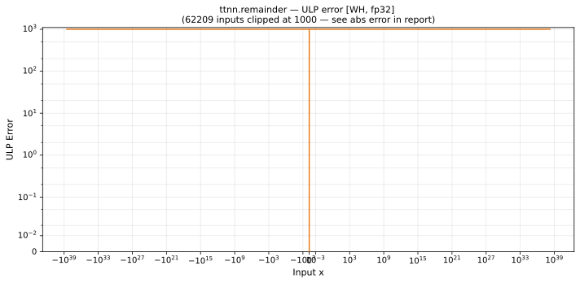

# remainder — Wormhole (WH), float32
_This page is auto-generated by `ttnn-accuracy report`. Do not edit manually._

**Architecture:** Wormhole (WH)  
**Data type:** float32  

---

[← Wormhole (WH) float32 ops](README.md) | [All archs for remainder](../../../by_op/remainder/README.md) | [Top](../../../README.md)

**Measured input range:** all normal values  

|  | `default` |
|---|---|
| Max ULP | 1.43e+45 ⚠ |
| Min ULP | 0.5 |
| Mean ULP | 1.68e+41 |
| Signed bias (ULP) | 2.67e+39 |
| p50 ULP | 1.7e+38 |
| p95 ULP | 3.48e+41 |
| p99 ULP | 1.39e+42 |
| Exact fraction | 0.00409 |
| Correctly rounded | 0.761 |
| Max abs error | 4.06e+31 |
| Max rel error | 1.13e+38 |
| Median rel error | 1.93e+31 |
| Bits of precision (worst) | -126 |
| Bits of precision (median) | -104 |

**default** — worst sampled pairing  

**Outcomes**

| Parameters | exact | inexact |
|---|---|---|
| `default` | 266 | 64,758 |

**Worst points**

| Parameters | x | x2 | golden | device | ULP |
|---|---|---|---|---|---|
| `default` | 1.2624444e+38 | 0.46795997 | 8.940697e-08 | -1.0141205e+31 | 1.43e+45 |
| `default` | 7.2313424e+12 | -4.6089892e-26 | -6.162976e-33 | 524288 | 7.14e+44 |
| `default` | -8.721946e+26 | 1.3789469e-11 | 8.6736174e-19 | 7.378698e+19 | 7.14e+44 |
| `default` | 3.0926266e+15 | 1.41747e-23 | 2.0510384e-29 | -268435460 | 1.78e+44 |
| `default` | 5.5159967e+09 | 1.8905285e-29 | 5.7176045e-35 | -512 | 8.92e+43 |
| `default` | 1.9607522e+35 | 0.0016799456 | 2.7939677e-09 | -1.9807041e+28 | 8.92e+43 |
| `default` | 2.252776e+36 | -0.006944829 | -1.9557774e-08 | 1.5845633e+29 | 8.92e+43 |
| `default` | -3.3810023e+25 | 1.2508481e-13 | 4.0657581e-19 | -2.305843e+18 | 8.92e+43 |
| `default` | -6.4548843e+34 | 0.0015594192 | 8.1490725e-10 | 4.9517602e+27 | 8.92e+43 |
| `default` | 4311756 | -2.1742045e-32 | -1.5869174e-37 | -0.5 | 4.46e+43 |

### Special values

| Variant | x | device | golden |  |
|---|---|---|---|---|
| `default` | 0 | 0 | 0 | agree |
| `default` | -0 | 0 | -0 | **differ** |
| `default` | inf | nan | nan | agree |
| `default` | -inf | nan | nan | agree |
| `default` | nan | nan | nan | agree |
| `default` | 1.1754944e-38 | 1.1754944e-38 | 1.1754944e-38 | agree |
| `default` | -1.1754944e-38 | 1 | 1 | agree |

> **Sampled, not exhaustive.** For this op both operands take 65,536 of the 2³² fp32 values, drawn once from a fixed seed. The figures above are a lower bound on the error, and comparable between releases, but they are not a bound over the dtype.

> **Provenance unknown.** These figures predate run tracking. Re-measure to attribute them.

