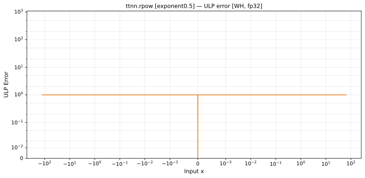
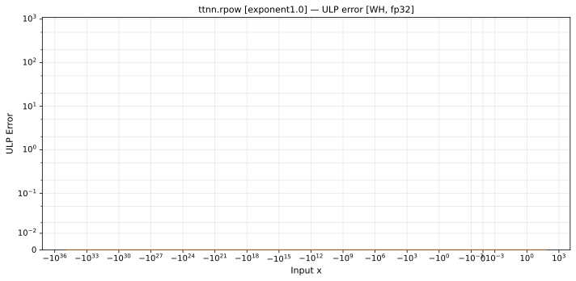
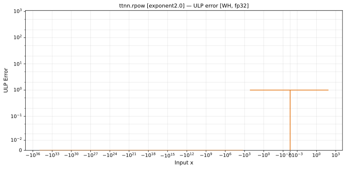

# rpow — Wormhole (WH), float32
_This page is auto-generated by `ttnn-accuracy report`. Do not edit manually._

**Architecture:** Wormhole (WH)  
**Data type:** float32  

---

[← Wormhole (WH) float32 ops](README.md) | [All archs for rpow](../../../by_op/rpow/README.md) | [Top](../../../README.md)

**Measured input range:** x ∈ [-3.403e+38, 128]  

|  | `exponent=0.5` | `exponent=1.0` | `exponent=2.0` |
|---|---|---|---|
| Max ULP | 0.879 | 0 | 0.879 |
| Min ULP | 0 | 0 | 0 |
| Mean ULP | 0.609 | 0 | 0.609 |
| Signed bias (ULP) | 0.104 | 0 | 0.104 |
| p50 ULP | 0 | 0 | 0 |
| p95 ULP | 0.683 | 0 | 0.58 |
| p99 ULP | 0.836 | 0 | 0.834 |
| Exact fraction | 0.835 | 1 | 0.882 |
| Correctly rounded | 0.995 | 1 | 0.996 |
| Accurate to \|x\| | 3.39e+38 | 8.28e+34 | 8.28e+34 |
| Max abs error | 1.69e+31 | 0 | 1.69e+31 |
| Max rel error | 7.5e-08 | 0 | 7.5e-08 |
| Median rel error | 5.96e-08 | 0 | 5.96e-08 |
| Bits of precision (worst) | 23.7 | — | 23.7 |
| Bits of precision (median) | 24 | — | 24 |

**exponent=0.5** — faithfully rounded; 5624 of 49536 points took the other neighbour · _the square-root path, a half-integer_  
**exponent=1.0** — 1536 of 49536 points returned inf or zero where a value exists · _degenerates to identity_  
**exponent=2.0** — 1536 of 49536 points returned inf or zero where a value exists · _squaring_  

**Outcomes**

| Parameters | exact | faithful | flushed | mismatch | overflow |
|---|---|---|---|---|---|
| `exponent=0.5` | 28,421 | 5,624 | 3 | 1,536 | 13,952 |
| `exponent=1.0` | 48,000 | 0 | 0 | 1,536 | 0 |
| `exponent=2.0` | 41,983 | 5,624 | 393 | 1,536 | 0 |

**Worst points**

| Parameters | x | golden | device | ULP |
|---|---|---|---|---|
| `exponent=0.5` | 0.46676773 | 0.72358394 | 0.7235839 | 0.879 |
| `exponent=0.5` | -0.5332323 | 1.4471679 | 1.4471678 | 0.879 |
| `exponent=0.5` | 0.46143463 | 0.7262637 | 0.72626364 | 0.875 |
| `exponent=0.5` | 0.4703973 | 0.7217658 | 0.72176576 | 0.869 |
| `exponent=0.5` | -0.5296027 | 1.4435316 | 1.4435315 | 0.869 |
| `exponent=0.5` | 0.46406782 | 0.72493935 | 0.7249393 | 0.868 |
| `exponent=0.5` | 1.4640678 | 0.36246967 | 0.36246964 | 0.868 |
| `exponent=0.5` | -0.5359322 | 1.4498787 | 1.4498786 | 0.868 |
| `exponent=0.5` | -1.5359322 | 2.8997574 | 2.8997571 | 0.868 |
| `exponent=0.5` | -0.46407083 | 1.3794286 | 1.3794287 | 0.867 |
| `exponent=2.0` | 0.5332323 | 1.4471679 | 1.4471678 | 0.879 |
| `exponent=2.0` | -0.46676773 | 0.72358394 | 0.7235839 | 0.879 |
| `exponent=2.0` | -0.46143463 | 0.7262637 | 0.72626364 | 0.875 |
| `exponent=2.0` | 0.5296027 | 1.4435316 | 1.4435315 | 0.869 |
| `exponent=2.0` | -0.4703973 | 0.7217658 | 0.72176576 | 0.869 |
| `exponent=2.0` | 0.5359322 | 1.4498787 | 1.4498786 | 0.868 |
| `exponent=2.0` | 1.5359322 | 2.8997574 | 2.8997571 | 0.868 |
| `exponent=2.0` | -0.46406782 | 0.72493935 | 0.7249393 | 0.868 |
| `exponent=2.0` | -1.4640678 | 0.36246967 | 0.36246964 | 0.868 |
| `exponent=2.0` | 0.46407083 | 1.3794286 | 1.3794287 | 0.867 |

**Monotonicity**

_Checked only where the reference is itself ordered, and never across a discontinuity._

| Parameters | Pairs | Violations | Rate | Worst \|Δy\| |
|---|---|---|---|---|
| `exponent=0.5` | 34,043 | 0 | 0 | 0 |
| `exponent=1.0` | 47,998 | 0 | 0 | 0 |
| `exponent=2.0` | 47,604 | 0 | 0 | 0 |

**Non-finite outputs**

| Parameters | Points | Both | Device only | Golden only | Device inf | Device nan | Golden inf | Golden nan |
|---|---|---|---|---|---|---|---|---|
| `exponent=0.5` | 15,488 | 13,952 | 0 | 1,536 | 13,952 | 0 | 15,488 | 0 |
| `exponent=1.0` | 1,536 | 0 | 1,536 | 0 | 1,536 | 0 | 0 | 0 |
| `exponent=2.0` | 1,536 | 0 | 1,536 | 0 | 1,536 | 0 | 0 | 0 |

| Parameters | x | golden | device |
|---|---|---|---|
| `exponent=0.5` | -128 | inf | inf |
| `exponent=0.5` | -129 | inf | inf |
| `exponent=0.5` | -130 | inf | inf |
| `exponent=0.5` | -131 | inf | inf |
| `exponent=0.5` | -132 | inf | inf |
| `exponent=0.5` | -133 | inf | inf |
| `exponent=0.5` | -134 | inf | inf |
| `exponent=0.5` | -135 | inf | inf |
| `exponent=0.5` | -136 | inf | inf |
| `exponent=0.5` | -137 | inf | inf |
| `exponent=1.0` | -8.307675e+34 | 1 | inf |
| `exponent=1.0` | -8.372579e+34 | 1 | inf |
| `exponent=1.0` | -8.437482e+34 | 1 | inf |
| `exponent=1.0` | -8.502386e+34 | 1 | inf |
| `exponent=1.0` | -8.56729e+34 | 1 | inf |
| `exponent=1.0` | -8.632194e+34 | 1 | inf |
| `exponent=1.0` | -8.697097e+34 | 1 | inf |
| `exponent=1.0` | -8.762001e+34 | 1 | inf |
| `exponent=1.0` | -8.826905e+34 | 1 | inf |
| `exponent=1.0` | -8.891808e+34 | 1 | inf |
| `exponent=2.0` | -8.307675e+34 | 0 | inf |
| `exponent=2.0` | -8.372579e+34 | 0 | inf |
| `exponent=2.0` | -8.437482e+34 | 0 | inf |
| `exponent=2.0` | -8.502386e+34 | 0 | inf |
| `exponent=2.0` | -8.56729e+34 | 0 | inf |
| `exponent=2.0` | -8.632194e+34 | 0 | inf |
| `exponent=2.0` | -8.697097e+34 | 0 | inf |
| `exponent=2.0` | -8.762001e+34 | 0 | inf |
| `exponent=2.0` | -8.826905e+34 | 0 | inf |
| `exponent=2.0` | -8.891808e+34 | 0 | inf |

### Special values

| Variant | x | device | golden |  |
|---|---|---|---|---|
| `exponent=0.5` | 0 | 1 | 1 | agree |
| `exponent=0.5` | -0 | 1 | 1 | agree |
| `exponent=0.5` | inf | 0 | 0 | agree |
| `exponent=0.5` | -inf | inf | inf | agree |
| `exponent=0.5` | nan | 0 | nan | **differ** |
| `exponent=0.5` | 1.1754944e-38 | 1 | 1 | agree |
| `exponent=0.5` | -1.1754944e-38 | 1 | 1 | agree |
| `exponent=1.0` | 0 | 1 | 1 | agree |
| `exponent=1.0` | -0 | 1 | 1 | agree |
| `exponent=1.0` | inf | inf | 1 | **differ** |
| `exponent=1.0` | -inf | 0 | 1 | **differ** |
| `exponent=1.0` | nan | inf | 1 | **differ** |
| `exponent=1.0` | 1.1754944e-38 | 1 | 1 | agree |
| `exponent=1.0` | -1.1754944e-38 | 1 | 1 | agree |
| `exponent=2.0` | 0 | 1 | 1 | agree |
| `exponent=2.0` | -0 | 1 | 1 | agree |
| `exponent=2.0` | inf | inf | inf | agree |
| `exponent=2.0` | -inf | 0 | 0 | agree |
| `exponent=2.0` | nan | inf | nan | **differ** |
| `exponent=2.0` | 1.1754944e-38 | 1 | 1 | agree |
| `exponent=2.0` | -1.1754944e-38 | 1 | 1 | agree |

_Measured on WORMHOLE_B0 · tt-metal `a3a9fb4229a` · ttnn `0.78.0` · run `20260917T224646`_

### `exponent=0.5`

### `exponent=1.0`

### `exponent=2.0`

