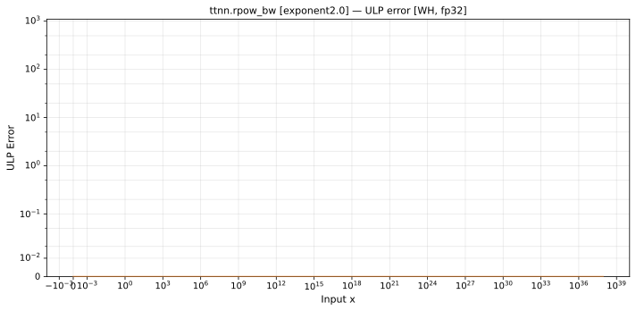

# rpow_bw — Wormhole (WH), float32
_This page is auto-generated by `ttnn-accuracy report`. Do not edit manually._

**Architecture:** Wormhole (WH)  
**Data type:** float32  

---

[← Wormhole (WH) float32 ops](README.md) | [All archs for rpow_bw](../../../by_op/rpow_bw/README.md) | [Top](../../../README.md)

**Measured input range:** x ∈ [-1.701e+38, 1.701e+38]  

|  | `exponent=2.0` |
|---|---|
| Max ULP | 0 |
| Min ULP | 0 |
| Mean ULP | 0 |
| Signed bias (ULP) | 0 |
| p50 ULP | 0 |
| p95 ULP | 0 |
| p99 ULP | 0 |
| Exact fraction | 1 |
| Correctly rounded | 1 |
| Accurate to \|x\| | 1.18e-38 |
| Max abs error | 0 |
| Max rel error | 0 |
| Median rel error | 0 |
| Bits of precision (worst) | — |
| Bits of precision (median) | — |

**exponent=2.0** — 32384 of 64768 points returned inf or zero where a value exists · _squaring_  

**Outcomes**

| Parameters | exact | mismatch |
|---|---|---|
| `exponent=2.0` | 32,384 | 32,384 |

**Monotonicity**

_Checked only where the reference is itself ordered, and never across a discontinuity._

| Parameters | Pairs | Violations | Rate | Worst \|Δy\| |
|---|---|---|---|---|
| `exponent=2.0` | 32,383 | 0 | 0 | 0 |

**Non-finite outputs**

| Parameters | Points | Both | Device only | Golden only | Device inf | Device nan | Golden inf | Golden nan |
|---|---|---|---|---|---|---|---|---|
| `exponent=2.0` | 32,384 | 0 | 32,384 | 0 | 0 | 32,384 | 0 | 0 |

| Parameters | x | golden | device |
|---|---|---|---|
| `exponent=2.0` | -1.1754944e-38 | -2.3509887e-38 | nan |
| `exponent=2.0` | -1.1846779e-38 | -2.3693558e-38 | nan |
| `exponent=2.0` | -1.1938615e-38 | -2.387723e-38 | nan |
| `exponent=2.0` | -1.203045e-38 | -2.40609e-38 | nan |
| `exponent=2.0` | -1.2122285e-38 | -2.424457e-38 | nan |
| `exponent=2.0` | -1.2214121e-38 | -2.4428242e-38 | nan |
| `exponent=2.0` | -1.2305956e-38 | -2.4611913e-38 | nan |
| `exponent=2.0` | -1.2397792e-38 | -2.4795584e-38 | nan |
| `exponent=2.0` | -1.2489627e-38 | -2.4979255e-38 | nan |
| `exponent=2.0` | -1.2581463e-38 | -2.5162926e-38 | nan |

### Special values

| Variant | x | device | golden |  |
|---|---|---|---|---|
| `exponent=2.0` | 0 | 0 | 0 | agree |
| `exponent=2.0` | -0 | 0 | -0 | **differ** |
| `exponent=2.0` | inf | inf | inf | agree |
| `exponent=2.0` | -inf | nan | -inf | **differ** |
| `exponent=2.0` | nan | nan | nan | agree |
| `exponent=2.0` | 1.1754944e-38 | 2.3509887e-38 | 2.3509887e-38 | agree |
| `exponent=2.0` | -1.1754944e-38 | nan | -2.3509887e-38 | **differ** |

> **Provenance unknown.** These figures predate run tracking. Re-measure to attribute them.

