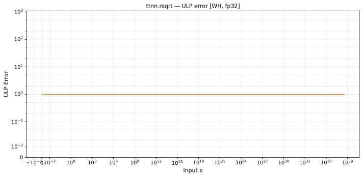

# rsqrt — Wormhole (WH), float32
_This page is auto-generated by `ttnn-accuracy report`. Do not edit manually._

**Architecture:** Wormhole (WH)  
**Data type:** float32  

---

[← Wormhole (WH) float32 ops](README.md) | [All archs for rsqrt](../../../by_op/rsqrt/README.md) | [Top](../../../README.md)

**Measured input range:** x ∈ [min\_normal, 3.403e+38]  

| Parameters | Max ULP | Mean ULP | Accurate to \|x\| | Max abs error |
|---|---|---|---|---------------|
| `default` | 1 | 1 | 3.39e+38 | 5.5e+11 |

**default** — within 2 ULP everywhere  

**Outcomes**

| Parameters | inexact |
|------------|------|
| `default` | 32,512 |

### Special values

| Variant | x | device | golden | |
|---|---|---|---|---|
| `default` | 0 | inf | inf | agree |
| `default` | -0 | nan | -inf | **differ** |
| `default` | inf | 0 | 0 | agree |
| `default` | -inf | nan | nan | agree |
| `default` | nan | nan | nan | agree |
| `default` | 1.175e-38 | 9.223e+18 | 9.223e+18 | agree |
| `default` | -1.175e-38 | nan | nan | agree |

_Measured on WORMHOLE_B0 · tt-metal `71e0727d990` · ttnn `0.1.dev30578+g5b8d933` · run `20260903T124708`_

