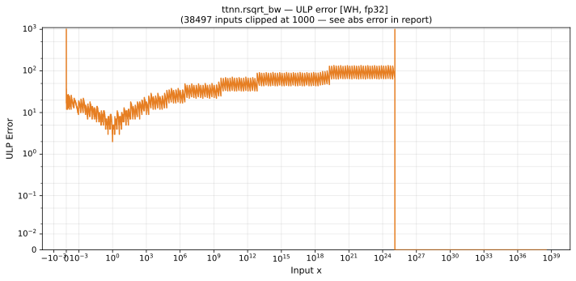

# rsqrt_bw — Wormhole (WH), float32
_This page is auto-generated by `ttnn-accuracy report`. Do not edit manually._

**Architecture:** Wormhole (WH)  
**Data type:** float32  

---

[← Wormhole (WH) float32 ops](README.md) | [All archs for rsqrt_bw](../../../by_op/rsqrt_bw/README.md) | [Top](../../../README.md)

**Measured input range:** x ∈ [1.295e-26, 1.217e+25]  

|  | `default` |
|---|---|
| Max ULP | 6.76 |
| Min ULP | 2.44 |
| Mean ULP | 4.26 |
| Signed bias (ULP) | 0.653 |
| p50 ULP | 3.81 |
| p95 ULP | 6.13 |
| p99 ULP | 6.33 |
| Exact fraction | 0 |
| Correctly rounded | 0.3 |
| Accurate to \|x\| | nowhere |
| Max abs error | 6.86e+31 |
| Max rel error | 4.87e-07 |
| Median rel error | 3.53e-07 |
| Bits of precision (worst) | 21 |
| Bits of precision (median) | 21.4 |

**default** — 75/21666 defects; rest 6.76 ULP  

**Outcomes**

| Parameters | inexact | mismatch |
|---|---|---|
| `default` | 21,591 | 75 |

**Worst points**

| Parameters | x | golden | device | ULP |
|---|---|---|---|---|
| `default` | 2.1695522e-26 | -1.5646415e+38 | -1.5646422e+38 | 6.76 |
| `default` | 8.678209e-26 | -1.9558018e+37 | -1.9558027e+37 | 6.76 |
| `default` | 3.4712836e-25 | -2.4447523e+36 | -2.4447534e+36 | 6.76 |
| `default` | 1.3885134e-24 | -3.0559404e+35 | -3.0559417e+35 | 6.76 |
| `default` | 5.5540537e-24 | -3.8199254e+34 | -3.8199272e+34 | 6.76 |
| `default` | 2.2216215e-23 | -4.7749068e+33 | -4.774909e+33 | 6.76 |
| `default` | 8.886486e-23 | -5.9686335e+32 | -5.9686362e+32 | 6.76 |
| `default` | 3.5545944e-22 | -7.460792e+31 | -7.4607953e+31 | 6.76 |
| `default` | 1.4218377e-21 | -9.32599e+30 | -9.325994e+30 | 6.76 |
| `default` | 5.687351e-21 | -1.1657487e+30 | -1.16574926e+30 | 6.76 |

**Monotonicity**

_Checked only where the reference is itself ordered, and never across a discontinuity._

| Parameters | Pairs | Violations | Rate | Worst \|Δy\| |
|---|---|---|---|---|
| `default` | 21,590 | 0 | 0 | 0 |

**Non-finite outputs**

| Parameters | Points | Both | Device only | Golden only | Device inf | Device nan | Golden inf | Golden nan |
|---|---|---|---|---|---|---|---|---|
| `default` | 75 | 0 | 75 | 0 | 75 | 0 | 0 | 0 |

| Parameters | x | golden | device |
|---|---|---|---|
| `default` | 1.294999e-26 | -3.3928593e+38 | -inf |
| `default` | 1.3050964e-26 | -3.3535601e+38 | -inf |
| `default` | 1.3151938e-26 | -3.315014e+38 | -inf |
| `default` | 1.3252913e-26 | -3.2772005e+38 | -inf |
| `default` | 1.3353887e-26 | -3.2401005e+38 | -inf |
| `default` | 1.3454861e-26 | -3.2036952e+38 | -inf |
| `default` | 1.3555835e-26 | -3.1679665e+38 | -inf |
| `default` | 1.365681e-26 | -3.132897e+38 | -inf |
| `default` | 1.3757783e-26 | -3.09847e+38 | -inf |
| `default` | 1.3858758e-26 | -3.0646688e+38 | -inf |

### Special values

| Variant | x | device | golden |  |
|---|---|---|---|---|
| `default` | 0 | inf | -inf | **differ** |
| `default` | -0 | inf | inf | agree |
| `default` | inf | 0 | -0 | **differ** |
| `default` | -inf | nan | nan | agree |
| `default` | nan | 0 | nan | **differ** |
| `default` | 1.1754944e-38 | -inf | -inf | agree |
| `default` | -1.1754944e-38 | nan | nan | agree |

_Measured on WORMHOLE_B0 · tt-metal `de546d3b146` · ttnn `0.79.0` · run `20261010T025807`_

