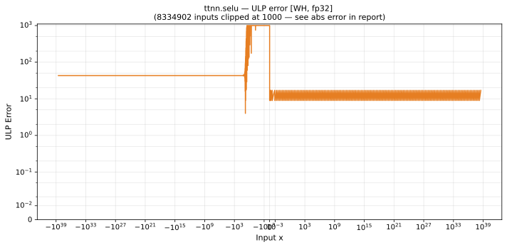

# selu — Wormhole (WH), float32
_This page is auto-generated by `ttnn-accuracy report`. Do not edit manually._

**Architecture:** Wormhole (WH)  
**Data type:** float32  

---

[← Wormhole (WH) float32 ops](README.md) | [All archs for selu](../../../by_op/selu/README.md) | [Top](../../../README.md)

**Measured input range:** x ∈ [-3.403e+38, 3.236e+38]  

|  | `default` |
|---|---|
| Max ULP | 51.3 |
| Min ULP | 8.83 |
| Mean ULP | 26.3 |
| Signed bias (ULP) | -13.5 |
| p50 ULP | 25.2 |
| p95 ULP | 43.2 |
| p99 ULP | 48.4 |
| Exact fraction | 0 |
| Correctly rounded | 0 |
| Accurate to \|x\| | nowhere |
| Max abs error | 3.46e+32 |
| Max rel error | 3.09e-06 |
| Median rel error | 2.9e-06 |
| Bits of precision (worst) | 18.3 |
| Bits of precision (median) | 18.4 |

**default** — never within 2 ULP  

**Outcomes**

| Parameters | inexact |
|---|---|
| `default` | 65,012 |

**Worst points**

| Parameters | x | golden | device | ULP |
|---|---|---|---|---|
| `default` | -0.15319242 | -0.2497123 | -0.24971154 | 51.3 |
| `default` | -0.15334363 | -0.24994038 | -0.24993962 | 51.3 |
| `default` | -0.33462662 | -0.49999425 | -0.49999273 | 51.2 |
| `default` | -0.3334489 | -0.49851167 | -0.49851015 | 51.1 |
| `default` | -0.073753245 | -0.12499932 | -0.12499894 | 51.1 |
| `default` | -0.073594004 | -0.124739245 | -0.124738865 | 51 |
| `default` | -0.15228137 | -0.24833748 | -0.24833672 | 51 |
| `default` | -0.0011106674 | -0.0019515796 | -0.0019515736 | 50.9 |
| `default` | -0.036165953 | -0.0624473 | -0.06244711 | 50.9 |
| `default` | -6.9321926e-05 | -0.00012187061 | -0.00012187024 | 50.9 |

**Monotonicity**

_Checked only where the reference is itself ordered, and never across a discontinuity._

| Parameters | Pairs | Violations | Rate | Worst \|Δy\| |
|---|---|---|---|---|
| `default` | 65,010 | 0 | 0 | 0 |

### Special values

| Variant | x | device | golden |  |
|---|---|---|---|---|
| `default` | 0 | 0 | 0 | agree |
| `default` | -0 | 0 | -0 | **differ** |
| `default` | inf | inf | inf | agree |
| `default` | -inf | -1.7580942 | -1.7580993 | **differ** |
| `default` | nan | nan | nan | agree |
| `default` | 1.1754944e-38 | 1.2350919e-38 | 1.2350931e-38 | **differ** |
| `default` | -1.1754944e-38 | -2.0666298e-38 | -2.0666358e-38 | **differ** |

_Measured on WORMHOLE_B0 · tt-metal `de546d3b146` · ttnn `0.79.0` · run `20261010T030007`_

