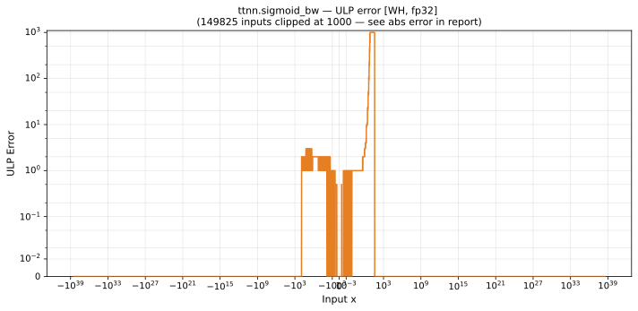

# sigmoid_bw — Wormhole (WH), float32
_This page is auto-generated by `ttnn-accuracy report`. Do not edit manually._

**Architecture:** Wormhole (WH)  
**Data type:** float32  

---

[← Wormhole (WH) float32 ops](README.md) | [All archs for sigmoid_bw](../../../by_op/sigmoid_bw/README.md) | [Top](../../../README.md)

**Measured input range:** x ∈ [-3.403e+38, 3.403e+38]  

|  | `default` |
|---|---|
| Max ULP | 8.39e+06 ⚠ |
| Min ULP | 0 |
| Mean ULP | 2.71e+04 |
| Signed bias (ULP) | -1.49e+04 |
| p50 ULP | 0 |
| p95 ULP | 0.569 |
| p99 ULP | 2.33 |
| Exact fraction | 0.942 |
| Correctly rounded | 0.975 |
| Accurate to \|x\| | 0.447 |
| Max abs error | 1.12e-07 |
| Max rel error | 1 |
| Median rel error | 9.84e-08 |
| Bits of precision (worst) | 5.37e-06 |
| Bits of precision (median) | 23.3 |

**default** — 140/65024 defects; rest 8.39e+06 ULP  

**Outcomes**

| Parameters | exact | faithful | flushed | inexact | zeroed |
|---|---|---|---|---|---|
| `default` | 60,763 | 827 | 386 | 2,908 | 140 |

**Worst points**

| Parameters | x | golden | device | ULP |
|---|---|---|---|---|
| `default` | 16.63553 | 5.960475e-08 | 1.19209275e-07 | 8.39e+06 |
| `default` | 16.624998 | 6.023585e-08 | 1.19209275e-07 | 8.3e+06 |
| `default` | 16.499998 | 6.8256156e-08 | 1.19209275e-07 | 7.17e+06 |
| `default` | 16.374998 | 7.734435e-08 | 1.19209275e-07 | 5.89e+06 |
| `default` | 16.249998 | 8.764263e-08 | 1.19209275e-07 | 4.44e+06 |
| `default` | 15.53692 | 1.7881395e-07 | 2.3841852e-07 | 4.19e+06 |
| `default` | 15.5625 | 1.7429782e-07 | 1.19209275e-07 | 3.88e+06 |
| `default` | 15.499999 | 1.8553925e-07 | 2.3841852e-07 | 3.72e+06 |
| `default` | 15.625 | 1.6373765e-07 | 1.19209275e-07 | 3.13e+06 |
| `default` | 15.437499 | 1.9750549e-07 | 2.3841852e-07 | 2.88e+06 |

**Monotonicity**

_Checked only where the reference is itself ordered, and never across a discontinuity._

| Parameters | Pairs | Violations | Rate | Worst \|Δy\| |
|---|---|---|---|---|
| `default` | 64,494 | 88 | 0.00136 | 4e-08 |

_Worst violations — the device output moved against the reference's own direction between these neighbouring inputs._

| Parameters | x | device | \|Δy\| |
|---|---|---|---|
| `default` | -0.0037626084 → -0.0037384033 | 0.24999914 → 0.2499991 | 4e-08 |
| `default` | -0.0028990763 → -0.0028729262 | 0.2499995 → 0.24999946 | 4e-08 |
| `default` | -0.007540159 → -0.007525014 | 0.24999647 → 0.24999644 | 3e-08 |
| `default` | -0.005382036 → -0.005360693 | 0.24999821 → 0.24999818 | 3e-08 |
| `default` | -0.0043505426 → -0.0043263296 | 0.24999884 → 0.24999881 | 3e-08 |

### Special values

| Variant | x | device | golden |  |
|---|---|---|---|---|
| `default` | 0 | 0.25 | 0.25 | agree |
| `default` | -0 | 0.25 | 0.25 | agree |
| `default` | inf | 0 | 0 | agree |
| `default` | -inf | 0 | 0 | agree |
| `default` | nan | 0 | nan | **differ** |
| `default` | 1.1754944e-38 | 0.25 | 0.25 | agree |
| `default` | -1.1754944e-38 | 0.25 | 0.25 | agree |

_Measured on WORMHOLE_B0 · tt-metal `de546d3b146` · ttnn `0.79.0` · run `20261010T025807`_

