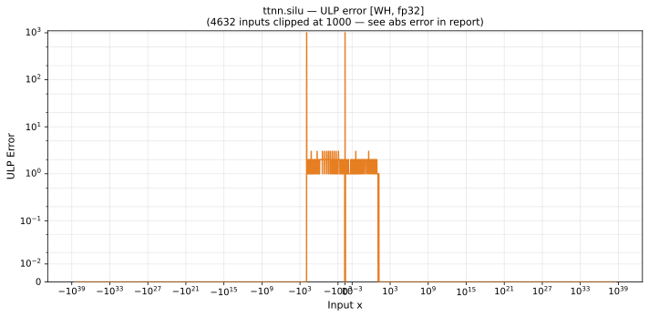

# silu — Wormhole (WH), float32
_This page is auto-generated by `scripts/generate_reports.py`. Do not edit manually._

_Generated: 2026-04-29 07:25 UTC_

**Architecture:** Wormhole (WH)  
**Data type:** float32  

---

[← Wormhole (WH) float32 ops](README.md) | [All archs for silu](../../../by_op/silu/README.md) | [Top](../../../README.md)

**Measured input range:** all normal values  

| Parameters | Max ULP | Mean ULP | Max abs error |
|------------|---------|----------|---------------|
| `default` | 1.68e+07 ⚠ | 1.66e+03 | 1.91e-06 |

> **Note:** ULP is not a useful metric near x ≈ 0 because the output itself is near zero. In x ∈ [-2.35e-38, 2.35e-38] (2 inputs): max absolute error = **1.18e-38**.

