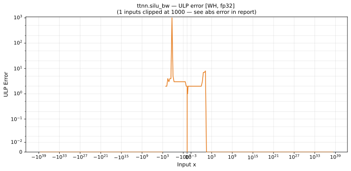

# silu_bw — Wormhole (WH), float32
_This page is auto-generated by `ttnn-accuracy report`. Do not edit manually._

**Architecture:** Wormhole (WH)  
**Data type:** float32  

---

[← Wormhole (WH) float32 ops](README.md) | [All archs for silu_bw](../../../by_op/silu_bw/README.md) | [Top](../../../README.md)

**Measured input range:** x ∈ [-3.403e+38, 3.403e+38]  

|  | `default` |
|---|---|
| Max ULP | 5.72e+06 ⚠ |
| Min ULP | 0 |
| Mean ULP | 841 |
| Signed bias (ULP) | 840 |
| p50 ULP | 0 |
| p95 ULP | 1.99 |
| p99 ULP | 2.97 |
| Exact fraction | 0.895 |
| Correctly rounded | 0.937 |
| Accurate to \|x\| | 2.98e-07 |
| Max abs error | 9.75e-07 |
| Max rel error | 0.439 |
| Median rel error | 1.52e-07 |
| Bits of precision (worst) | 1.19 |
| Bits of precision (median) | 22.7 |

**default** — 9 of 65024 points returned inf or zero where a value exists  

**Outcomes**

| Parameters | exact | faithful | flushed | inexact | zeroed |
|---|---|---|---|---|---|
| `default` | 57,825 | 1,094 | 377 | 5,719 | 9 |

**Worst points**

| Parameters | x | golden | device | ULP |
|---|---|---|---|---|
| `default` | -1.2784644 | 2.313814e-08 | 1.298259e-08 | 5.72e+06 |
| `default` | -1.2827622 | -0.0009333664 | -0.00093339354 | 466 |
| `default` | -1.2708572 | 0.0016654601 | 0.001665438 | 190 |
| `default` | -1.2906461 | -0.002631554 | -0.002631581 | 116 |
| `default` | -1.2618824 | 0.003652188 | 0.0036521659 | 94.7 |
| `default` | -1.2974299 | -0.0040782643 | -0.0040782914 | 58.2 |
| `default` | -1.3050668 | -0.0056908703 | -0.0056908973 | 57.7 |
| `default` | -1.3131305 | -0.007375227 | -0.0073752524 | 55.1 |
| `default` | -1.2440822 | 0.00766298 | 0.007663002 | 47.5 |
| `default` | -1.2528944 | 0.0056656688 | 0.0056656906 | 47 |

### Special values

| Variant | x | device | golden |  |
|---|---|---|---|---|
| `default` | 0 | 0.5 | 0.5 | agree |
| `default` | -0 | 0.5 | 0.5 | agree |
| `default` | inf | nan | nan | agree |
| `default` | -inf | nan | nan | agree |
| `default` | nan | nan | nan | agree |
| `default` | 1.1754944e-38 | 0.5 | 0.5 | agree |
| `default` | -1.1754944e-38 | 0.5 | 0.5 | agree |

> **Provenance unknown.** These figures predate run tracking. Re-measure to attribute them.

