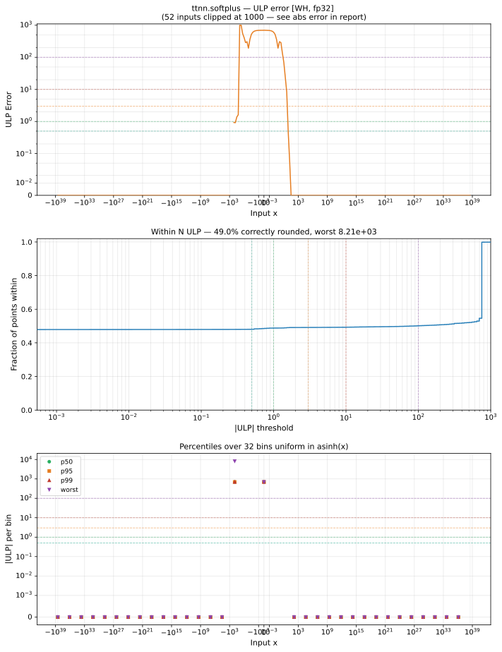

# softplus — Wormhole (WH), float32
_This page is auto-generated by `ttnn-accuracy report`. Do not edit manually._

**Architecture:** Wormhole (WH)  
**Data type:** float32  

---

[← Wormhole (WH) float32 ops](README.md) | [All archs for softplus](../../../by_op/softplus/README.md) | [Top](../../../README.md)

**Measured input range:** x ∈ [-3.403e+38, 3.403e+38]  

| Parameters | Max ULP | Mean ULP | Accurate to \|x\| | Max abs error |
|---|---|---|---|---------------|
| `default` | 8.2e+03 ⚠ | 656 | nowhere | 6.93e+35 |

**default** — 30 of 65024 points returned inf or zero where a value exists  

**Outcomes**

| Parameters | exact | flushed | inexact | mismatch |
|------------|------|------|------|------|
| `default` | 31,077 | 395 | 33,522 | 30 |

### Special values

| Variant | x | device | golden | |
|---|---|---|---|---|
| `default` | 0 | 0.6931 | 0.6931 | agree |
| `default` | -0 | 0.6931 | 0.6931 | agree |
| `default` | inf | inf | inf | agree |
| `default` | -inf | 0 | 0 | agree |
| `default` | nan | nan | nan | agree |
| `default` | 1.175e-38 | 0.6931 | 0.6931 | agree |
| `default` | -1.175e-38 | 0.6931 | 0.6931 | agree |

_Measured on WORMHOLE_B0 · tt-metal `812427269cb` · ttnn `0.1.dev30578+g5b8d933` · run `20260902T135808`_

