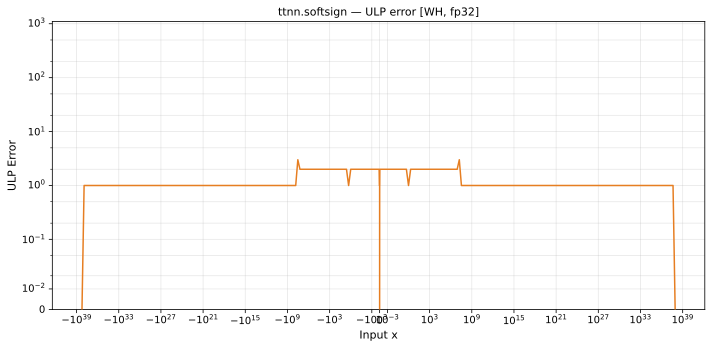

# softsign — Wormhole (WH), float32
_This page is auto-generated by `ttnn-accuracy report`. Do not edit manually._

**Architecture:** Wormhole (WH)  
**Data type:** float32  

---

[← Wormhole (WH) float32 ops](README.md) | [All archs for softsign](../../../by_op/softsign/README.md) | [Top](../../../README.md)

**Measured input range:** x ∈ [-3.403e+38, 3.403e+38]  

|  | `default` |
|---|---|
| Max ULP | 2.66 |
| Min ULP | 0 |
| Mean ULP | 0.897 |
| Signed bias (ULP) | 0 |
| p50 ULP | 0.5 |
| p95 ULP | 1.62 |
| p99 ULP | 1.95 |
| Exact fraction | 0.416 |
| Correctly rounded | 0.92 |
| Accurate to \|x\| | 0.000462 |
| Max abs error | 1 |
| Max rel error | 1.63e-07 |
| Median rel error | 7.01e-08 |
| Bits of precision (worst) | 22.5 |
| Bits of precision (median) | 23.8 |

**default** — 510 of 65024 points returned inf or zero where a value exists; the rest reach 2.66 ULP  

**Outcomes**

| Parameters | exact | faithful | inexact | zeroed |
|---|---|---|---|---|
| `default` | 26,806 | 6,112 | 31,596 | 510 |

**Worst points**

| Parameters | x | golden | device | ULP |
|---|---|---|---|---|
| `default` | 25548244 | 0.99999994 | 1.0000001 | 2.66 |
| `default` | -25548244 | -0.99999994 | -1.0000001 | 2.66 |
| `default` | 25726316 | 0.99999994 | 1.0000001 | 2.65 |
| `default` | -25726316 | -0.99999994 | -1.0000001 | 2.65 |
| `default` | 25834268 | 0.99999994 | 1.0000001 | 2.65 |
| `default` | -25834268 | -0.99999994 | -1.0000001 | 2.65 |
| `default` | 26066448 | 0.99999994 | 1.0000001 | 2.64 |
| `default` | -26066448 | -0.99999994 | -1.0000001 | 2.64 |
| `default` | 26092172 | 0.99999994 | 1.0000001 | 2.64 |
| `default` | -26092172 | -0.99999994 | -1.0000001 | 2.64 |

**Monotonicity**

_Checked only where the reference is itself ordered, and never across a discontinuity._

| Parameters | Pairs | Violations | Rate | Worst \|Δy\| |
|---|---|---|---|---|
| `default` | 64,512 | 1,134 | 0.0176 | 2e-07 |

_Worst violations — the device output moved against the reference's own direction between these neighbouring inputs._

| Parameters | x | device | \|Δy\| |
|---|---|---|---|
| `default` | -32505854 → -32262264 | -0.9999999 → -1.0000001 | 2e-07 |
| `default` | -27787258 → -27568592 | -0.9999999 → -1.0000001 | 2e-07 |
| `default` | -25690110 → -25548244 | -0.9999999 → -1.0000001 | 2e-07 |
| `default` | -16908258 → -16711681 | -0.9999998 → -1 | 2e-07 |
| `default` | -1982209.9 → -1966247.1 | -0.9999994 → -0.9999996 | 2e-07 |

### Special values

| Variant | x | device | golden |  |
|---|---|---|---|---|
| `default` | 0 | 0 | 0 | agree |
| `default` | -0 | 0 | -0 | **differ** |
| `default` | inf | nan | nan | agree |
| `default` | -inf | nan | nan | agree |
| `default` | nan | nan | nan | agree |
| `default` | 1.1754944e-38 | 1.1754944e-38 | 1.1754944e-38 | agree |
| `default` | -1.1754944e-38 | -1.1754944e-38 | -1.1754944e-38 | agree |

_Measured on WORMHOLE_B0 · tt-metal `a3a9fb4229a` · ttnn `0.78.0` · run `20260929T112230`_

