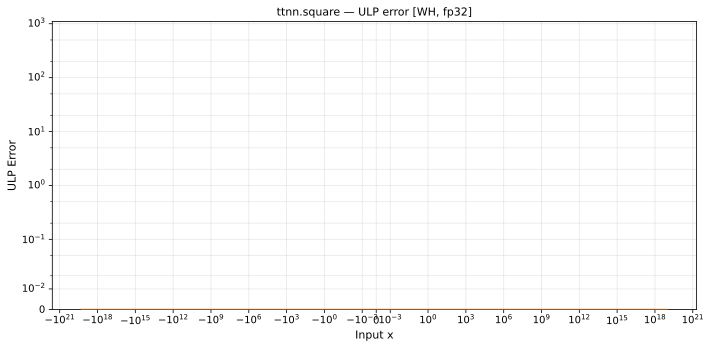

# square — Wormhole (WH), float32
_This page is auto-generated by `ttnn-accuracy report`. Do not edit manually._

**Architecture:** Wormhole (WH)  
**Data type:** float32  

---

[← Wormhole (WH) float32 ops](README.md) | [All archs for square](../../../by_op/square/README.md) | [Top](../../../README.md)

**Measured input range:** x ∈ [-1.845e+19, 1.845e+19]  

|  | `default` |
|---|---|
| Max ULP | 0.5 |
| Min ULP | 0.5 |
| Mean ULP | 0 |
| Signed bias (ULP) | 0 |
| p50 ULP | 0.5 |
| p95 ULP | 0.5 |
| p99 ULP | 0.5 |
| Exact fraction | 1 |
| Correctly rounded | 1 |
| Accurate to \|x\| | 1.84e+19 |
| Max abs error | 1.01e+31 |
| Max rel error | 5.96e-08 |
| Median rel error | 0 |
| Bits of precision (worst) | 24 |
| Bits of precision (median) | — |

**default** — bit-exact  

**Outcomes**

| Parameters | exact | flushed |
|---|---|---|
| `default` | 32,512 | 16,128 |

**Worst points**

| Parameters | x | golden | device | ULP |
|---|---|---|---|---|
| `default` | 1.0844669e-19 | 1.1760683e-38 | 1.1760683e-38 | 0.5 |
| `default` | 1.0929372e-19 | 1.1945117e-38 | 1.1945117e-38 | 0.5 |
| `default` | 1.1014075e-19 | 1.2130985e-38 | 1.2130985e-38 | 0.5 |
| `default` | 1.1098779e-19 | 1.2318288e-38 | 1.2318288e-38 | 0.5 |
| `default` | 1.1183482e-19 | 1.2507026e-38 | 1.2507026e-38 | 0.5 |
| `default` | 1.1268185e-19 | 1.2697199e-38 | 1.2697199e-38 | 0.5 |
| `default` | 1.1352888e-19 | 1.2888807e-38 | 1.2888807e-38 | 0.5 |
| `default` | 1.1437592e-19 | 1.308185e-38 | 1.308185e-38 | 0.5 |
| `default` | 1.1522295e-19 | 1.3276328e-38 | 1.3276328e-38 | 0.5 |
| `default` | 1.1606998e-19 | 1.347224e-38 | 1.347224e-38 | 0.5 |

**Monotonicity**

_Checked only where the reference is itself ordered, and never across a discontinuity._

| Parameters | Pairs | Violations | Rate | Worst \|Δy\| |
|---|---|---|---|---|
| `default` | 32,510 | 0 | 0 | 0 |

### Special values

| Variant | x | device | golden |  |
|---|---|---|---|---|
| `default` | 0 | 0 | 0 | agree |
| `default` | -0 | 0 | 0 | agree |
| `default` | inf | inf | inf | agree |
| `default` | -inf | inf | inf | agree |
| `default` | nan | nan | nan | agree |
| `default` | 1.1754944e-38 | 0 | 0 | agree |
| `default` | -1.1754944e-38 | 0 | 0 | agree |

_Measured on WORMHOLE_B0 · tt-metal `a3a9fb4229a` · ttnn `0.78.0` · run `20260920T190031`_

