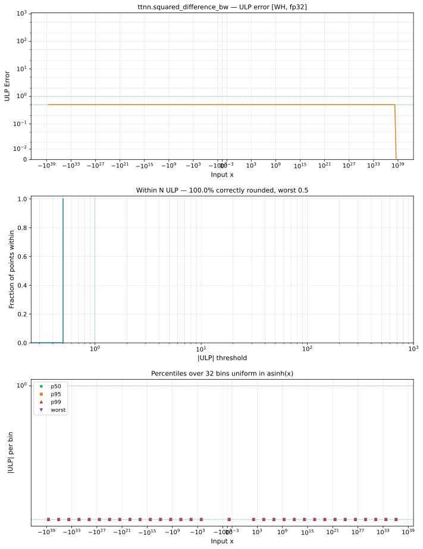

# squared_difference_bw — Wormhole (WH), float32
_This page is auto-generated by `ttnn-accuracy report`. Do not edit manually._

**Architecture:** Wormhole (WH)  
**Data type:** float32  

---

[← Wormhole (WH) float32 ops](README.md) | [All archs for squared_difference_bw](../../../by_op/squared_difference_bw/README.md) | [Top](../../../README.md)

**Measured input range:** all normal values  

|  | `default` |
|---|---|
| Max ULP | 0.5 |
| Min ULP | 0 |
| Mean ULP | 0 |
| Signed bias (ULP) | 0 |
| p50 ULP | 0.5 |
| p95 ULP | 0.5 |
| p99 ULP | 0.5 |
| Exact fraction | 1 |
| Correctly rounded | 1 |
| Max abs error | 1.01e+31 |
| Max rel error | 5.96e-08 |
| Median rel error | 0 |
| Bits of precision (worst) | 24 |
| Bits of precision (median) | — |

**default** — bit-exact  

**Outcomes**

| Parameters | exact |
|---|---|
| `default` | 65,024 |

**Worst points**

| Parameters | x | x2 | golden | device | ULP |
|---|---|---|---|---|---|
| `default` | 1.1837498e-38 | 3.535236e-38 | -4.702973e-38 | -4.702973e-38 | 0.5 |
| `default` | 1.187421e-38 | 3.5518438e-38 | -4.7288453e-38 | -4.7288453e-38 | 0.5 |
| `default` | 1.2021456e-38 | 5.932572e-38 | -9.460852e-38 | -9.460852e-38 | 0.5 |
| `default` | 1.2092162e-38 | 3.571135e-38 | -4.7238377e-38 | -4.7238377e-38 | 0.5 |
| `default` | 1.2204055e-38 | 3.589478e-38 | -4.7381444e-38 | -4.7381444e-38 | 0.5 |
| `default` | 1.2232443e-38 | 3.589478e-38 | -4.7324674e-38 | -4.7324674e-38 | 0.5 |
| `default` | 1.237559e-38 | 1.0679535e-37 | -1.8883952e-37 | -1.8883952e-37 | 0.5 |
| `default` | 1.2484311e-38 | 5.971328e-38 | -9.445794e-38 | -9.445794e-38 | 0.5 |
| `default` | 1.2494089e-38 | 3.902037e-37 | -7.554192e-37 | -7.554192e-37 | 0.5 |
| `default` | 1.2614992e-38 | 3.6272972e-38 | -4.7315964e-38 | -4.7315964e-38 | 0.5 |

### Special values

| Variant | x | device | golden |  |
|---|---|---|---|---|
| `default` | 0 | -2 | -2 | agree |
| `default` | -0 | -2 | -2 | agree |
| `default` | inf | inf | inf | agree |
| `default` | -inf | -inf | -inf | agree |
| `default` | nan | nan | nan | agree |
| `default` | 1.1754944e-38 | -2 | -2 | agree |
| `default` | -1.1754944e-38 | -2 | -2 | agree |

> **Sampled, not exhaustive.** For this op both operands take 65,536 of the 2³² fp32 values, drawn once from a fixed seed. The figures above are a lower bound on the error, and comparable between releases, but they are not a bound over the dtype.

> **Provenance unknown.** These figures predate run tracking. Re-measure to attribute them.

