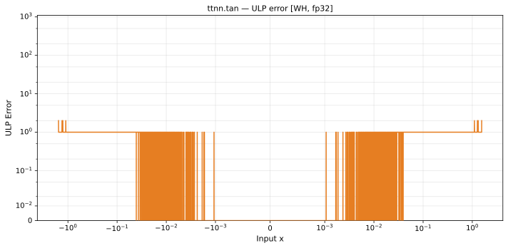

# tan — Wormhole (WH), float32
_This page is auto-generated by `ttnn-accuracy report`. Do not edit manually._

_Generated: 2026-08-31 08:49_

**Architecture:** Wormhole (WH)  
**Data type:** float32  

---

[← Wormhole (WH) float32 ops](README.md) | [All archs for tan](../../../by_op/tan/README.md) | [Top](../../../README.md)

**Measured input range:** x ∈ [-3.403e+38, 3.403e+38]  

| Parameters | Max ULP | Mean ULP | Accurate to \|x\| | Max abs error |
|---|---|---|---|---------------|
| `default` | 3.34e+38 ⚠ | 1.43e+36 | 20.2 | 1.22e+38 |

**default** — accurate to |x| <= 20.2; up to 3.34e+38 ULP beyond  

**Outcomes**

| Parameters | exact | inexact | mismatch | zeroed |
|------------|------|------|------|------|
| `default` | 30,396 | 10,020 | 24,578 | 30 |

_Measured on WORMHOLE_B0 · tt-metal `2adf8c65887` · ttnn `0.75.0rc10.dev817+g2adf8c65887` · run `20260831T073009`_

