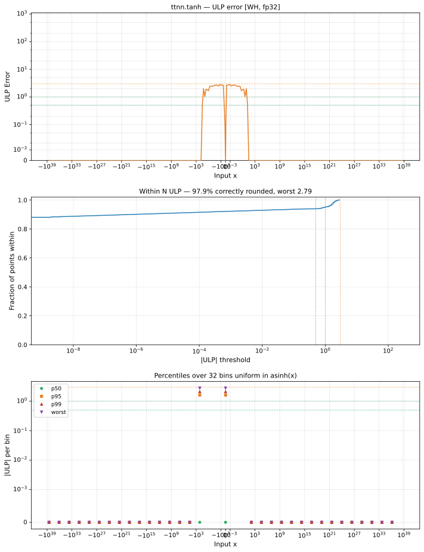

# tanh — Wormhole (WH), float32
_This page is auto-generated by `scripts/generate_reports.py`. Do not edit manually._

_Generated: 2026-04-29 11:51 UTC_

**Architecture:** Wormhole (WH)  
**Data type:** float32  

---

[← Wormhole (WH) float32 ops](README.md) | [All archs for tanh](../../../by_op/tanh/README.md) | [Top](../../../README.md)

**Measured input range:** all normal values  

| Parameters | Max ULP | Mean ULP | Max abs error |
|------------|---------|----------|---------------|
| `default` | 8.39e+06 ⚠ | 1.01 | 2.38e-07 |

> **Note:** ULP is not a useful metric near x ≈ 0 because the output itself is near zero. In x ∈ [-1.18e-38, 1.18e-38] (2 inputs): max absolute error = **1.18e-38**.

