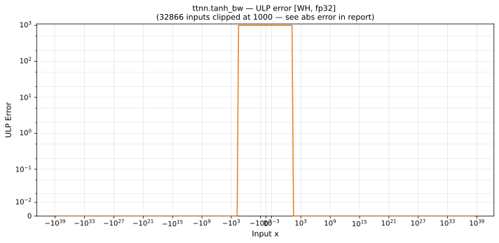

# tanh_bw — Wormhole (WH), float32
_This page is auto-generated by `ttnn-accuracy report`. Do not edit manually._

**Architecture:** Wormhole (WH)  
**Data type:** float32  

---

[← Wormhole (WH) float32 ops](README.md) | [All archs for tanh_bw](../../../by_op/tanh_bw/README.md) | [Top](../../../README.md)

**Measured input range:** x ∈ [-3.403e+38, 3.403e+38]  

|  | `default` |
|---|---|
| Max ULP | 4.19e+06 ⚠ |
| Min ULP | 0 |
| Mean ULP | 9.01e+03 |
| Signed bias (ULP) | 7e+03 |
| p50 ULP | 5.88e+03 |
| p95 ULP | 6.88e+03 |
| p99 ULP | 1.35e+04 |
| Exact fraction | 0.485 |
| Correctly rounded | 0.485 |
| Accurate to \|x\| | nowhere |
| Max abs error | 0.000814 |
| Max rel error | 0.5 |
| Median rel error | 0.000803 |
| Bits of precision (worst) | 1 |
| Bits of precision (median) | 10.3 |

**default** — never within 2 ULP; mean 9.01e+03, worst 4.19e+06  

**Outcomes**

| Parameters | exact | inexact |
|---|---|---|
| `default` | 31,390 | 33,634 |

**Worst points**

| Parameters | x | golden | device | ULP |
|---|---|---|---|---|
| `default` | 18.512241 | 2.220446e-16 | 3.3307416e-16 | 4.19e+06 |
| `default` | -18.512241 | 2.220446e-16 | 3.3307416e-16 | 4.19e+06 |
| `default` | 19.061546 | 2.220446e-16 | 1.1102266e-16 | 4.19e+06 |
| `default` | -19.061546 | 2.220446e-16 | 1.1102266e-16 | 4.19e+06 |
| `default` | 18.999998 | 2.220446e-16 | 1.2556588e-16 | 3.64e+06 |
| `default` | -18.999998 | 2.220446e-16 | 1.2556588e-16 | 3.64e+06 |
| `default` | 18.874998 | 2.220446e-16 | 1.6123571e-16 | 2.3e+06 |
| `default` | -18.874998 | 2.220446e-16 | 1.6123571e-16 | 2.3e+06 |
| `default` | 18.256828 | 6.661338e-16 | 5.5511014e-16 | 2.1e+06 |
| `default` | -18.256828 | 6.661338e-16 | 5.5511014e-16 | 2.1e+06 |

**Monotonicity**

_Checked only where the reference is itself ordered, and never across a discontinuity._

| Parameters | Pairs | Violations | Rate | Worst \|Δy\| |
|---|---|---|---|---|
| `default` | 65,022 | 2 | 3.08e-05 | 4.38e-05 |

_Worst violations — the device output moved against the reference's own direction between these neighbouring inputs._

| Parameters | x | device | \|Δy\| |
|---|---|---|---|
| `default` | -3 → -2.9999948 | 0.009914957 → 0.009871125 | 4.38e-05 |
| `default` | 2.9999948 → 3 | 0.009871125 → 0.009914957 | 4.38e-05 |

### Special values

| Variant | x | device | golden |  |
|---|---|---|---|---|
| `default` | 0 | 0.999197 | 1 | **differ** |
| `default` | -0 | 0.999197 | 1 | **differ** |
| `default` | inf | 0 | 0 | agree |
| `default` | -inf | 0 | 0 | agree |
| `default` | nan | 0 | nan | **differ** |
| `default` | 1.1754944e-38 | 0.999197 | 1 | **differ** |
| `default` | -1.1754944e-38 | 0.999197 | 1 | **differ** |

_Measured on WORMHOLE_B0 · tt-metal `a3a9fb4229a` · ttnn `0.78.0` · run `20260929T111615`_

